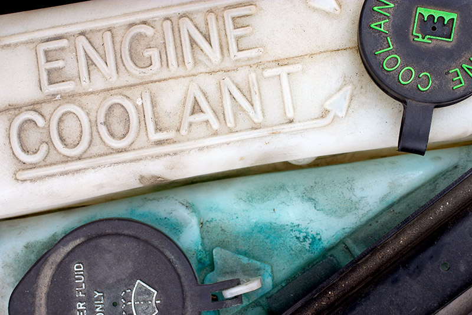

As temperatures fall to freezing many people tend to think more about anti-freeze for their vehicle. Although, as Matthews Tire Green Bay Store Manager Tom Winninghoff says, “It’s really something drivers should monitor year-round.” To better understand why we need to monitor our engine’s temperature, we must understand what exactly anti-freeze is and how it works.

**What is Anti-freeze?**
Anti-freeze—also referred to as "coolant"—is an additive that lowers the freezing point of your engine's fluid and, conversely, increases the boiling point. "Basically, if you were to just run water through your engine’s system, it would boil or freeze depending on the temperature in and outside of your vehicle and we can’t have that," Winninghoff explains. "Engine coolant or anti-freeze prevents your engine from boiling or freezing."

**How Does Anti-freeze Work?**
Anti-freeze is a special formula that absorbs one third of the heat or cold in your engine. The other two thirds is then dissipated through your vehicle's heating and cooling system. "There are also anti-corrosion elements to anti-freeze, which is why it's extremely important to monitor your level of anti-freeze and get regular flushes," Winninghoff recommends.

**What is an Anti-freeze/Coolant Flush?**
"Much like how dialysis is done on kidneys, the liquid in your engine needs to be flushed and replenished too," Winninghoff explains. Matthews Tire does a full coolant flush where they actually pump all the old liquid through the vehicle's system, removing all contaminants with it. "We don't just drain it," Winninghoff says. When coolant or anti-freeze sits in the aluminum parts of your engine, small particles can accumulate in your engine's fluid. Those particles can cause corrosion over time and damage to your engine. By flushing your old engine coolant, you're also removing any damaging particles and replacing it with new, clean liquid.

Matthews Tire recommends getting a coolant flush every 100,000 miles. You can make an appointment at Matthews Tire or tack it on to your next oil change for convenience. A full engine flush only takes an extra 45 minutes to an hour, and keeps your engine running steady, even when temperatures outside are less predictable.
