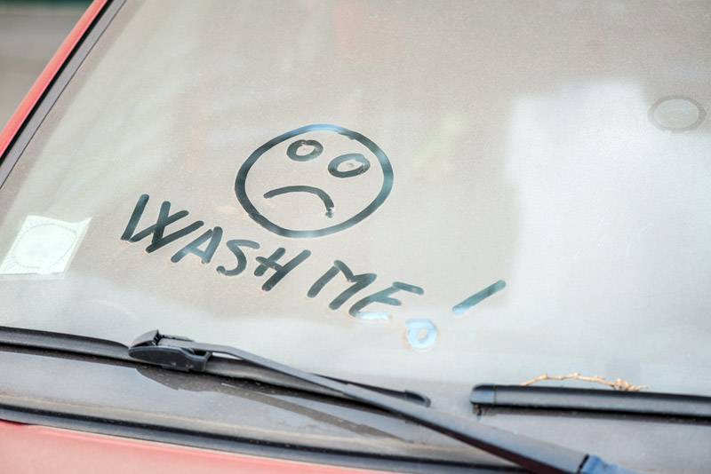

**Dirt is damaging …**

A dirty, grimy car is more than just an eyesore. Dirt can do real damage to the exterior finish. According to Farmers Insurance:

- Dirt buildup can act like sandpaper, wearing down and weakening paint.
- Grime can mix with rain and other pollutants, etching your paint off.
- This also allows other substances—like sap, tar and bird droppings—to ruin your paint even faster.
- When paint is cracked, etched, or chipped, the car’s body is vulnerable to moisture and that can lead to the much-feared rust!

After a wash, don't neglect to wax. Wax serves as a highly effective protective barrier between the environment and your finish. Regularly applied, quality wax keeps your vehicle looking better for far longer than an unprotected vehicle.

**Lower value**

Rust—or even just a dull finish—on a vehicle often means it will be worth less when you attempt to sell or trade it in. Almost no one wants to spend money on an unattractive, poorly maintained car. Additionally, even if you’ve kept up with regular mechanical maintenance, most people assume that a car that looks bad on the outside hasn’t been maintained under the hood.

**Less safe**

Everyone agrees it’s unsafe to drive with windows covered in ice or snow. But dirt, bugs, pollen and other substances on your windows can impede your vision and be just as dangerous. For the safety of all, keep your windows clean.

**Diminished fuel economy**

It may surprise you, but a clean car is more fuel efficient than a dirty car. According to TV’s Mythbusters, dirt particles on your car create more drag as air particles cling onto the grime. And it’s not an insignificant amount. According to their calculations, that “filth effect” cuts fuel economy by up to 10%!

**Unclean is unhealthy**

As you get in and out of your car you bring in dirt and germs from everywhere you go. Think of all the things you touch before you grasp your steering wheel or your seatbelt buckle. Regularly wiping down your vehicle’s interior surfaces can cut down on germs and could even keep you from getting sick.

**Do your car&mdash;and yourself&mdash;a favor and keep it clean!**

As you can see, the advantages of a clean vehicle are numerous. Whether you drive into your local car wash or decide to save some money (and get some exercise) by doing it yourself, regular car washing and interior cleaning makes good sense.
