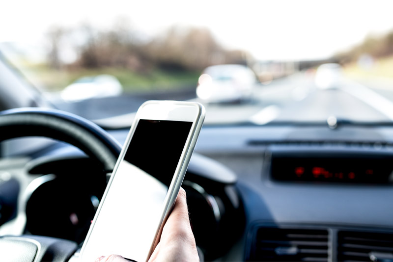

The National Safety Council has declared April to be Distracted Driving Awareness Month. Last year more than 40,000 people were killed on our nation’s roadways and distracted driving was a major contributor in many of those fatalities. Now is the time to pump the brakes on this national safety threat and recognize the real risks of technology in the vehicle.

First, it's important to dispel a few myths. Here are some of the most common distracted driving myths and recent findings from the [AAA Foundation for Traffic Safety](http://aaafoundation.org/research/).

**Myth #1: Voice command features are safe while driving.** Research shows that voice-activated in-car technologies dangerously undermine driver attention. Also, distraction lingers—up to 27 seconds after a call ends.

**Myth #2: Hands-free calls don’t count as distracted driving.** While hands-free calls may be a safe alternative to texting, research shows drivers still miss 50% of their driving environment while on a speaker phone.

**Myth #3: Multitasking is possible and is considered a talent.** "Multitasking" doesn't actually exist. When simultaneously performing tasks (such as texting and driving) your brain is merely switching back and forth between tasks. Every time the brain switches, it slows reaction time.

Set the wheels of change in motion! Keep both hands on the wheel and your eyes on the road with these safe driving tips from Matthews Tire:

- Put your phone away. Stash your phone in a purse, bag or somewhere out of reach to deter your natural habit to pick it up when your device beeps or lights up.

- Set your phone to silent. When you can’t hear it, you’re less tempted to touch your device.

- Configure GPS before starting the vehicle. Before putting the car in drive, think about where you’re going. Do you know exactly where it is? If not look up the location and route before leaving.

- Prioritize and practice patience. Do you want your last words to be “LOL”? Think about the importance of what you’re sending. Can it wait? Is it worth risking your life? Most messages can simply be sent after the drive.

- Designate a passenger to text. If you have multiple people in a car for a long duration and know that you’ll need to communicate with others, designate a passenger to facilitate all communication.

- Download an app that disables texting. There are many free apps that disable social media and texting functions while the car is in motion. Some even provide incentive programs for miles driven without texting! Get a list of apps from [honkforhelp.com](https://www.honkforhelp.com/explore/2016/5-free-apps-to-prevent-texting-while-driving/).

- Visit <a target="_blank" href="https://forms.nsc.org/distracteddriving_pledge.aspx?utm_medium=(none)&utm_source=(direct)&utm_campaign=pledge&utm_medium=(none)&utm_source=(direct)&utm_campaign=pledge">nsc.org</a> for more resources to combat distracted driving, including a distracted driving pledge from the National Safety Council. Encourage your entire family to make the promise and _Just Drive_.
