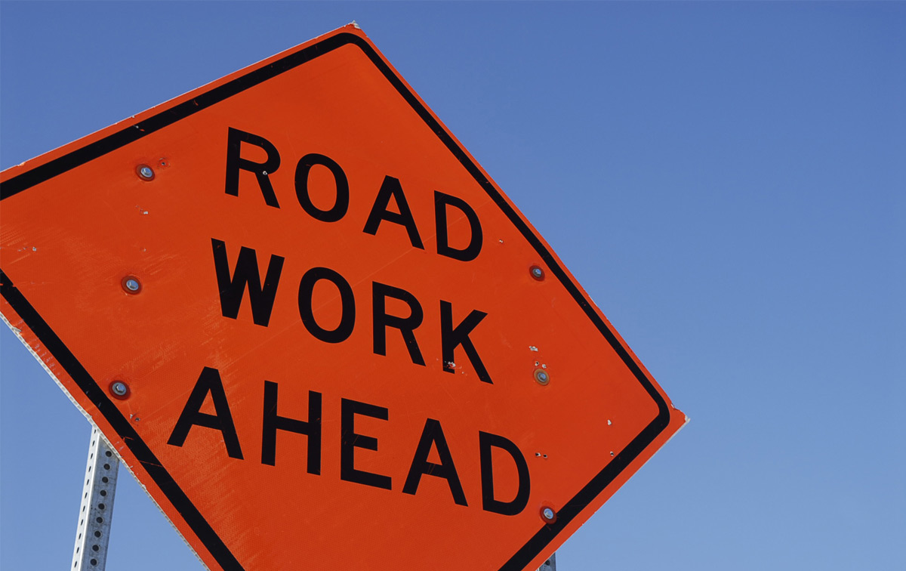

Summer has arrived. There are leaves on the trees, boats on the water and orange barrels on the roads! It's prime time for construction on our state’s roadways and Northeast Wisconsin is no exception. It's important to be aware of areas under construction. Some of the major projects this season include Brown County's US 41 Resurfacing and US 41 / County B Interchange Reconstruction, Outagamie County's WIS 55 Kaukauna Reconstruction and the continuation of Winnebago County's six-year WIS 441 Tri-county Expansion Project. Get the latest updates on these projects and more from the <a target="_blank" href="https://projects.511wi.gov/region/northeast/">Wisconsin Department of Transportation (DOT)</a>.

These projects may be great for the job market, but they can present many inconveniences and safety hazards for drivers. Narrowed roads, unexpected detours, debris and roadside workers are just some distractions that make construction sites more difficult to navigate. Here are a few things to consider when driving through a work zone …

**Put down your phone** 
It is illegal to talk on a handheld mobile device while driving in Wisconsin road work zones. Drivers in violation of this law face fines of up to $40 on first offense and $100 for subsequent offenses.

**Watch for signs** 
Keep an eye out for work zone signs including flashing lights, utility or emergency vehicles, orange signs, flags, barrels, cones—and most importantly—workers. If you injure a worker due to careless driving, you could face thousands of dollars in fines or up to 3-1/2 years in prison.

**Slow down** 
Speed limits are reduced for good reason. Drivers must have ample reaction time to navigate around sharp turns, lane closures and active workers. Plus, fines double in work zones!

**Don't tailgate** 
The Wisconsin DOT recommends that drivers allow for three seconds of braking room. Rear-end collisions are the most common work zone crashes.

**Observe rules during all hours** 
Just because you don’t see workers operating machinery, that doesn’t mean they aren’t there. Nearly 2,000 work zone crashes occur in Wisconsin each year and most fatalities are not workers, but drivers and their passengers.

Visit the <a target="_blank" href="http://wisconsindot.gov/Pages/safety/education/workzone/default.aspx">Wisconsin DOT</a> website for updates on all construction projects in Northeast Wisconsin, plus get more facts and tips for driving safely through construction zones.
