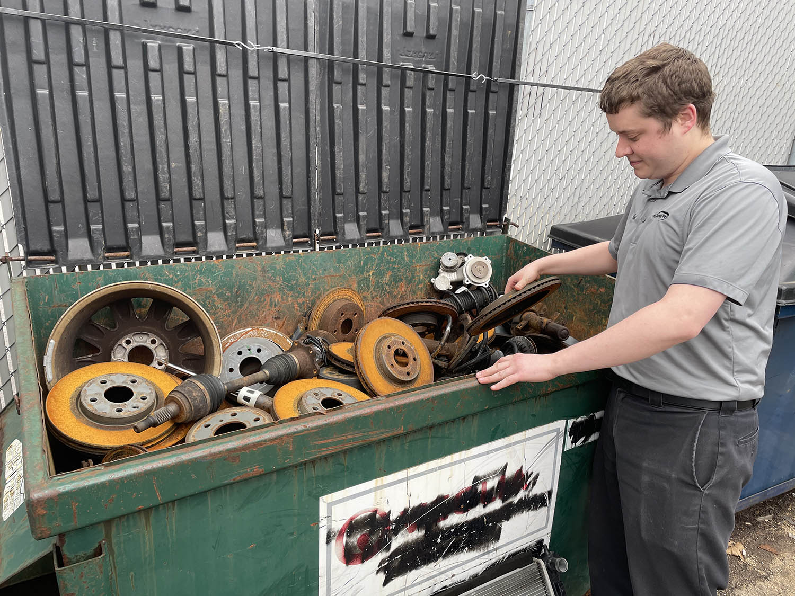

Earth Day is just around the corner and serves as a great reminder to appreciate our natural surroundings and do everything we can to preserve them. Matthews Tire Menasha Manager Sean Brucks says sustainability is a big part of daily operations in their shop. “It’s the little details and efforts that add up to big impact,” he stated. Learn how Matthews Tire applies sustainable practices in the auto shop:

## LED light is a win-win

Sean says, in the past few years, Matthews Tire has made significant strides to make all locations more energy efficient. “We’ve gone through the building twice now to improve lighting,” he shared. “LED lighting drives down energy costs and offers brighter light at a lower wattage. We’ve moved to energy-efficient lighting even in the bathrooms, showrooms and outside the building!”

## Most parts are recycled

According to Sean, Matthews Tire recycles more than you’d expect. With multiple dedicated containers and bins behind each location, Matthews Tire technicians recycle everything from oil, other fluids, tires, batteries, even scrap metal! “All oil is bulked up, refined into a base oil, and then shipped out to be recycled,” he explained. “We even put our customers’ used oil into waste oil burners to heat some of our buildings! Also, bare metals, exhaust systems, brake pads, rotors, etc. are in a separate dumpster for recycling. A LOT gets recycled in this business,” he emphasized.

## Out with paper, in with digital

As a family-owned business since 1952, Matthews Tire used paper for customer communication, technician reports, business transactions and more for decades. “We are proud to have gone full digital with inspections and, though there is still some paper documentation, over 90% is done on a tablet now,” Sean proclaimed. “We’ve definitely cut down on paper and it’s often more convenient for customers!”

## Embracing electric innovation

While Matthews doesn’t specialize in hybrid services, “Our ASE-certified technicians are trained to service them for tires, batteries and basic service,” Sean explained. “Knowing that electric vehicles are the wave of the future, we have specific tools and training to continue learning about them,” he shared further. “Part of that is simply networking with area businesses or going to the technical colleges. We are part of the conversation.”

## What can YOU do?

After learning what Matthews Tire does to be more eco-friendly, you may wonder what you can do. For drivers, Sean advises vehicle maintenance is key. “By bringing your vehicle in for routine inspections and maintenance, you can preserve fuel. You get better fuel economy when your vehicle is running smoothly. Plus, when you take care of your vehicle, it lasts longer. There’s less need to buy new vehicles, reducing your carbon footprint.”

<a href="/locations/">Schedule maintenance</a> at your nearest Matthews Tire today!
