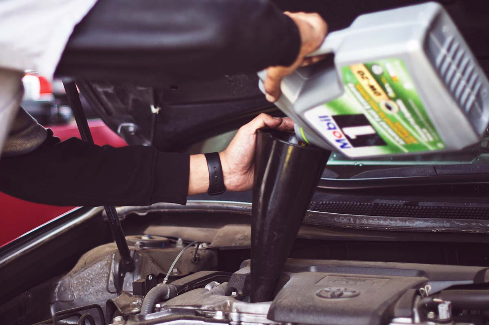

At Matthews Tire, we try to make every possible effort to conserve waste, recycle what we can and be overall good stewards of this beautiful Earth we admire when on the open road. One of the most significant ways we conserve waste at Matthews Tire is partnering with Safety-Kleen for recycling oils and fluids our technicians use each day.

Safety-Kleen is the largest re-refiner of used oil in North America. Their environmentally responsible services ensure the proper collection, processing, re-refining, recycling and disposal of hazardous and non-hazardous materials. With more than 200 million gallons of used oils sent through their refineries each year, Saftey-Kleen has the recycling process down to an art. Here’s a step-by-step breakdown of how it’s done, according to Safety-Kleen.com:

## 1. Testing

Used oil can contain a variety of contaminants. To ensure the highest quality oil throughout the re-refining process and environmentally correct recycling, the oil is tested constantly.

## 2. Dehydration

Overtime, oil can store water. Using evaporation, all water is removed from the oil, is chemically/biologically treated and then discharged.

## 3. Recovery

The used oil then goes to tall recovery towers where glycol and light fuels are separated and collected. Glycol is eventually reprocessed as a finished automotive grade product.

## 4. Stripping

Fuel stripping removes the heavier fuels from the oils for industrial purposes. The used oil is then subjected to heat and vacuum processes to extract middleweight oils, or fuels for industrial heating.

## 5. Distillation

The heaviest impurities are removed in a complex series of processes and can be used for many industrial purposes. The used oil is vaporized in an extreme vacuum and then condensed.

## 6. Final Treatment

Remaining oil is treated with hydrogen to remove impurities, plus correct odor, color and corrosion performance. The purified oil is then separated by weight and ready for use in the auto industry and other industrial applications.

While complex, the oil recycling process helps us reduce waste, makes the most of our resources and often results in a product more refined than the original. The staff at Matthews Tire is proud to partner with eco-friendly advocates like Safety-Kleen and so many more!

Oil is just one product we recycle at Matthews Tire. <a href="https://matthewstire.com/blog/reduce-reuse-recycle-your-old-tires.html">Learn more about how all used tires from our shops are reused and recycled</a>. And for even more ways to see the Matthews Tire difference, stop by your <a href="/locations/">nearest location</a> today!
