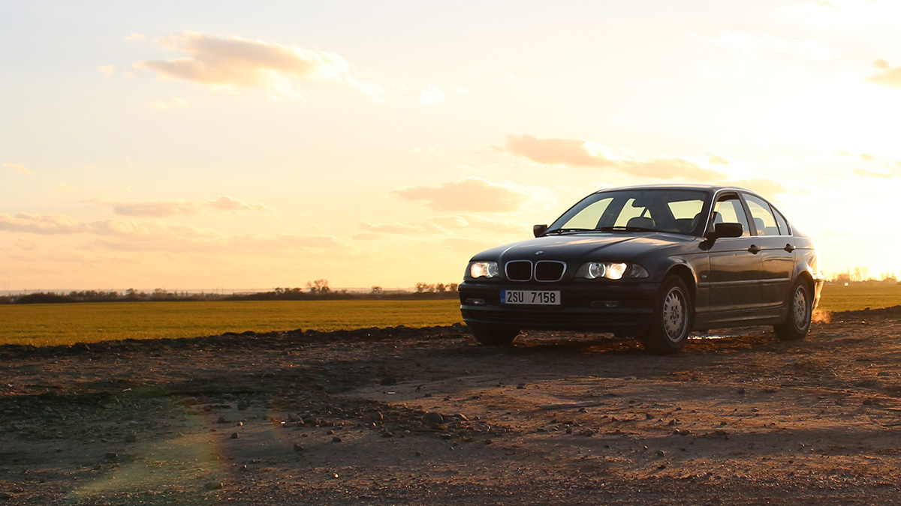

From dirt and bugs to clogging and breaking, car air filters are more important than you think.

You’re sitting in the lobby waiting for your car to be repaired. A technician walks in with a dirty, clogged filter and shows it to you. They ask if you’d like to replace it and you respond, “Nah, maybe next time.” What’s the harm of waiting a couple of months to replace it?

Truth be told, it’s harmful to you and your car when you wait to change your cabin air filter and engine air filter. “Car filters are similar to filters in your furnace,” says Matthews Tire Green Bay manager Tom Winninghoff. “When these filters get clogged, they force other components to work harder and inefficiently,” he adds.

Don’t let air filters ruin how your car operates. Here’s why you need to replace your car air filters often:

**Increase Fuel Efficiency**
 [Studies](http://www.familyhandyman.com/automotive/car-maintenance/save-money-on-gas-tips-for-better-gas-mileage-fuel-economy/view-all) show replacing your engine air filter improves the air flow to your car’s engine which can lead to better gas mileage. “We check air filters during every auto repair and changing your air filter every 15,000 miles will make a difference,” Winninghoff states.

**Extend Engine Life**
 If you have an old air filter, dirt and other particles can reach the engine’s intake system. Over time, this can wear away parts of your engine such as cylinders and engine bearings that will need to be repaired sooner rather than later. A clean air filter will also increase your engine’s performance.

**Minimize Heating and Cooling Issues**
 Clogged air filters means less air is getting through to your engine and the inside of your car. Don’t let bugs, dirt and other uninvited particles damage your heating and cooling systems that could be costly down the road.

**Trap More Dirt**
 This seems obvious, but a clean air filter traps more dirt than you think&mdash;at least 97% of it! “If you or your family suffers from allergies, your car filters may be the culprit,” says Winninghoff. “A clean air filter could help ease your allergy symptoms.”

**Reduce Pollutants**
 If you wash your dishes with a dirty sponge, do you expect them to be clean? If your air filter is dirty, you could be breathing in more pollutants riding in your car than if you were walking down the street! Let your air filters do their job—keeping the air clean in your car.

**And remember, if you have any questions about your automotive needs, don’t hesitate to call the pros at Matthews Tire!**
