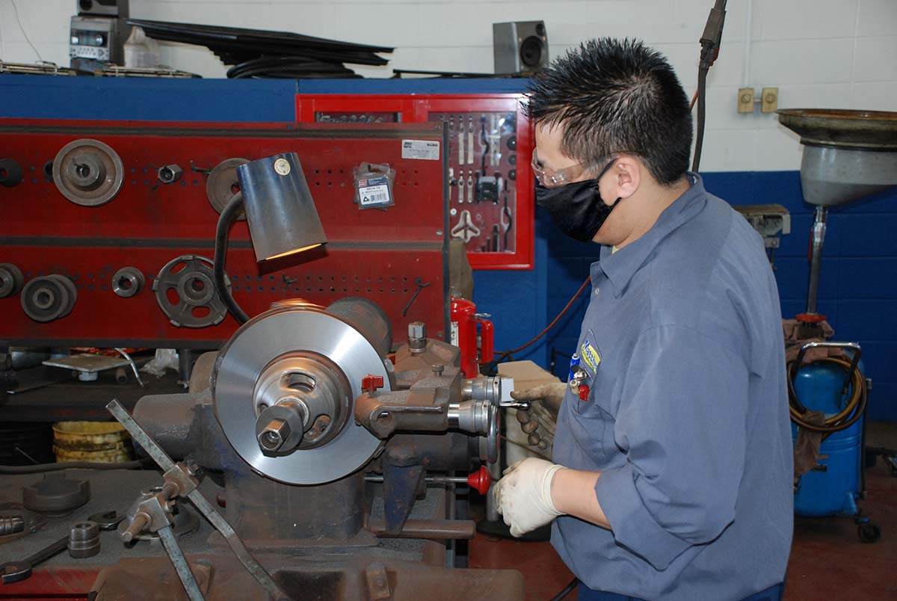

With over seven locations in northeast Wisconsin and a growing reputation for expert service, there’s a secret to the success of Matthews Tire and it has nothing to do with tools and tires. It’s the people! Matthews Tire Menasha Store Manager Sean Brucks shares, “We look for service technicians who are dedicated … technicians who are big on communication and they’ll go the extra mile to ensure service is done correctly on time, the first time.”

Matthews Tire also puts emphasis on education. In addition to their hands-on experience and automotive degrees, all Matthews Tire technicians are ASE-certified and have completed extensive on-the-job training to learn the nuts and bolts of all the vehicles that come through their shop each day. Matthews Tire even employs students currently in school and offers reimbursement programs for employees wishing to accelerate their education.

“We look for employees who are committed. We want to invest in people who want to stick around and grow with our company,” Brucks shared. As a family owned and operated company, Matthews Tire currently employs over 90 employees, many who have been with the company for 10, 15, even 20 years or more! “When you come into Matthews Tire you can expect to see the same faces,” Brucks assured. “Your vehicle is often the second biggest investment you make in life (behind your house) and being able to communicate with your technician and get to know them face to face … that’s important.”

Another benefit of experienced and dedicated technicians include the amount of variety they see over the years at their stores. “At a dealership, those technicians are only trained and experienced on that one brand,” Sean said. “At Matthews Tire, we see it all.” Matthews even invests in advanced training to work on hybrid and diesel vehicles, ADAS features and commercial fleets. “Our technicians are educated on every year, make and model. We train ourselves across the board,” Brucks added.

Do YOU have what it takes to be a Matthews Tire Technician?

✔️ Associate Degree in Automotive Technology 
✔️ Hands-on experience 
✔️ Strong communicator 
✔️ Interest in ongoing learning 
✔️ Dependable 
✔️ Tech savvy 

Most Matthews Tire employees come for the competitive wages and great benefits including health, dental, vision and 401K. But they stay for the family atmosphere, small-town feel, camaraderie and ongoing opportunity. “We’re here to make a living and serve customers, but also to make it an enjoyable, fun working atmosphere,” Sean shared. That’s the Matthews Tire difference!

To view open positions at Matthews Tire and apply today, visit our [careers](/careers/) page!
