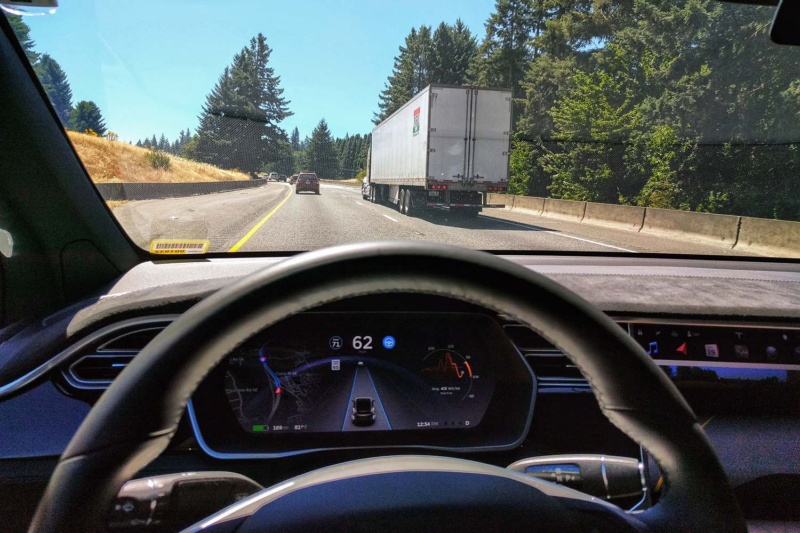

Matthews Tire is proud to offer expert ADAS (Advanced Driver-Assistance Systems) service for all vehicle makes and models. Since emerging onto the automotive scene in the early 2000s, ADAS features have quickly evolved, gaining more momentum as technology has rapidly advanced in recent years. Many vehicles come with simple computer-automated features—such as tire pressure monitoring—but have recently advanced to slick safe-driving conveniences that almost emulate a technological forcefield around your vehicle!

Some of the most common safe-driving ADAS features today include adaptive cruise control, lane departure warnings, forward collision warnings, night vision/pedestrian detection, parking assistance and even traffic sign recognition. With all of these sophisticated features comes more complex repairs. Now you can count on Matthews Tire for service of these ADAS features including diagnostics, repairs and recalibrations. Our expert technicians are trained on industry-leading recalibration computer software to know the direct targets for sensors on any vehicle. The software is auto-updated daily to maintain the latest specifications for all makes and models.

If you have a vehicle with ADAS features, you don’t need to worry about regular maintenance or tune-ups to the system. Usually all ADAS repairs or recalibrations are a result of other work done on the vehicle. Matthews Tire Operations Adviser Pat Duesing explains, “Let’s say you get your driver-side mirror replaced. If your vehicle has ADAS, that mirror has a camera and sensors in it that need to be calibrated to the vehicle’s exact specifications to accurately detect motion and distance,” he said. “We have the technology to ensure your new mirror is calibrated to successfully operate with the ADAS features of your exact vehicle.”

Soon, it will be mandated for all vehicles to have crash avoidance systems. “It’s necessary to offer this service when repairing various parts of vehicles that have ADAS, and soon enough, they all will,” Duesing added.

To learn more about Matthews Tire’s ADAS capabilities and other services, contact the <a href="https://matthewstire.com/locations/">location nearest you</a>.
