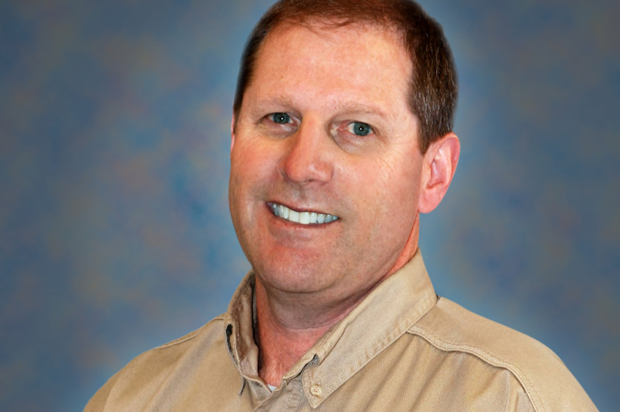

Fond du Lac store manager Todd Steffes is celebrating 20 years with Matthews Tire this April. Todd first started at Matthews Tire on April 8, 1996 as store manager and has continued to hold that position throughout his time with the company. He’s been certified as an ASE-certified technician since 2001 and is also on the advisory committee for the automotive technician program at Moraine Park Technical College.

When asked what has kept Todd at Matthews Tire for so long he replied, “It’s the people. Everyone employed at Matthews is friendly, respectful and good at what they do, which makes my job enjoyable.”

With two decades of automotive and customer service experience under his belt, Todd has seen a lot while managing the Fond du Lac store. “I’ve seen some crazy stuff—damage from rodents living in vehicles and, most notably, brake rotors worn down to the hubs,” Todd recalled. “I also have observed significant changes in vehicle technology throughout my career with the addition of GPS, computer monitors and control systems.”

While Todd reflects fondly on those everyday experiences, they pale in comparison to his all-time favorite memory at Matthews. “I was lucky enough to go to the <i>Ride and Drive</i> event at Continental Tire’s facility in Uvalde, Texas,” he shared. Located 80 miles west of San Antonio, Uvalde’s mild year-round climate and rural location are ideal for Continental’s tire performance trials, and testing of top secret vehicles and components. “It was a fun, informative and very memorable trip.”

Looking forward, Todd is excited for the future at Matthews Tire and hopes to add many more memorable experiences to his career—including a joy ride in his all-time favorite car, a 1969 Pontiac GTO.
