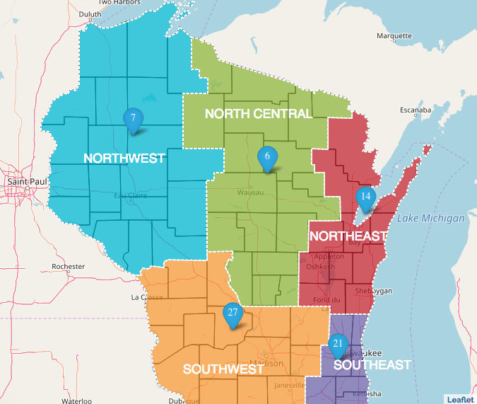

Summer in Wisconsin may feel fleeting, but the summer road construction season seems to last forever! Everyone gets frustrated navigating orange barrels, sitting in slower-than-usual traffic and following long detours. However, education is the key to efficient summer driving. When you want to know what specific Wisconsin highways and byways impacted by construction, visit [511 Wisconsin Construction Projects](https://projects.511wi.gov/). Here you’ll find maps and descriptions of road construction projects organized by region of the state. Clicking further into the site you can read a synopsis of each project, view a timeline of project milestones, read all about the likely impact on traffic and study the suggested detour routes.

Currently, when you are driving to the Menasha Matthews Tire store—located at 1690 Appleton Rd.—you may encounter the The WIS 441 Project. When completed, this project will reconstruct and expand approximately six miles of US 10/WIS 441 from four lanes to six lanes between Cold Spring Road (County CB) and Oneida Street (US 10) in Winnebago County as well as reconstruct five interchanges and the Roland Kampo Bridge. Be aware of the potential for sudden lanes changes, temporary closures, reduced speed limits and detour signage in this entire area.

“Feel free to give us a call before you bring your car in,” said Craig Keberlein, Menasha store manager. “We pay attention to the local situation and we’re happy to help you find the best route to the store,” he added.

Work zones require extra caution. Did you know that it is illegal to talk on a handheld mobile device while driving in a Wisconsin road work zone? Drivers in violation face fines of up to $40 on first offense and $100 for subsequent offenses. Remember the mantra, “Orange cones—put down the phones!” Speeding in a work zone is also ill advised as penalties are doubled, and fines usually increase every year. Of course a fine is nothing compared to potential prison time, not to mention the lethal danger you pose to workers, other drivers and yourself. In general, it’s always smart to be vigilant and observe all laws when driving, but it’s even more important in construction and other work zones.

In addition to consecution projects, you can find statewide real-time traveler information—including accidents, weather conditions and more—by dialing 511 or visiting the main [511 Wisconsin website](https://511wi.gov).

