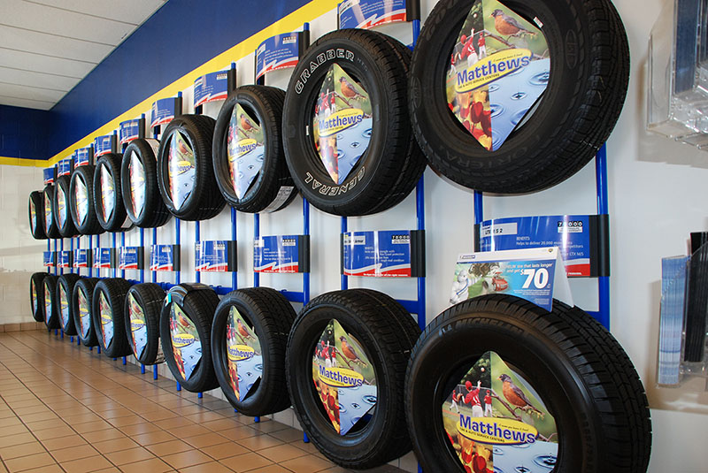

Fall in Wisconsin is a welcome change of pace with football (maybe), crisp mornings and vibrant changing leaves. But with those things also comes the unwelcome aspects of the season, like increased rainfall. Many people assume snow is the most dangerous threat to roadways, without even considering the risks associated with rain. According to the National Highway Traffic Safety Administration, data from 2005-2014 found that 73% of weather-related crashes occurred on wet roads. Additionally, 46% of weather-related crashes involved rainfall while just 17% of crashes happened while it was snowing.

## Prepare for Fall Storms

There are some ways to reduce the danger of driving in the rain and increase your safety. Get a grip on slippery fall weather by upgrading your tires and wipers before the weather turns!

## Replace Your Windshield Wipers

Selecting the right wiper blades is important and easy to do with help from Matthews Tire. Our ASE-certified Technicians can help you decide which wipers are best your vehicle and install them! We carry various types and sizes of ANCO wiper blades. For more than 100 years, ANCO has been perfecting their wiper blades. From conventional, to specialty or beam wiper blades, they manufacture all shapes and sizes for ultimate performance. If you are more of a do-it-yourselfer, finding the right wiper blades is easy. Consult your owner’s manual for your vehicle’s specific blade size in inches.

## Signs it’s time for new wipers …

✔ Streaking or smearing indicates dirty or worn blades 
✔ Skipping/chattering shows blades are old and have warped 
✔ Brittle texture and splitting from freezing temperatures 
✔ Wipers should be changed every six months for maximum performance

## Quality windshield wipers are …

✔ Made with a silicon coating (more resistant to the elements) 
✔ Sharp, with smooth edges 
✔ Properly fit for your vehicle (consult your owner’s manual) 
✔ A trusted brand, such as ANCO

## Invest in New Tires

It’s no secret—some tires are simply better than others. And when it comes to safe fall and winter driving, you need the best. From Continental, Goodyear and Michelin to Dunlop and Bridgestone, Matthews Tire carries all the best brand name tires. Our friendly and helpful ASE-certified technicians can help you decide which tires are best for your vehicle, plus we take care of the installation.

## Signs it’s time to replace tires …

✔ Do the penny test (Insert a penny head-first into the tread. If you always see Lincoln’s head above the tread, your tires are worn.) 
✔ Cracked sidewalls 
✔ Rumbling noise while driving 
✔ Recommended replacement every six years

## Quality tires are …

✔ Purchased brand new 
✔ Properly fit to the make/model of your vehicle 
✔ Installed by ASE-Certified experts 
✔ A trusted brand, such as Goodyear or Michelin
If you need help preparing for the change of seasons, [contact your neighborhood Matthews Tire](/locations/) for assistance.
