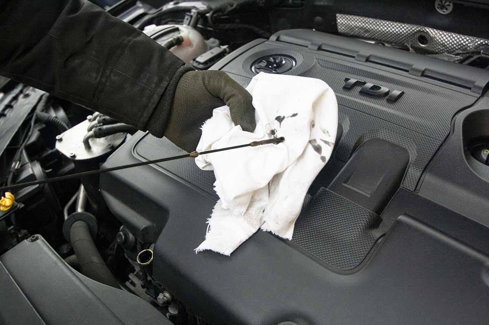

**Matthews Tire Gets Real About Those Pesky—but Necessary—Oil Changes.**

**#1 Oil Changes Take Too Much Time!**

Think about this … at Matthews Tire to properly do an oil change, we do a lot more than you think. Sure we drain the old oil and add in the new oil, plus change your filter. But did you know we also check your lights, air filter, cabin air filter, tire pressure, tread depths, and all your belts and hoses? As if that’s not enough, we also replace any shields and splash guards that may have needed removal to do the oil change in the first place. And lastly, we need to reset the service indicators for the next time you’ll need service.

_The time we take means a thorough inspection and a quality oil change for you._

**#2 Topping Off Your Fluids Is Just a Gimmick!**

You’ll be happy to know at Matthews Tire, we do top off your fluids—it’s free of charge! Antifreeze, window washer, brake, and transmission fluid are all included in every oil change. If we find any of your fluids are lower than expected, we recommend service to fix the potential problem. (There’s likely be a charge for that repair, but we make sure to get your approval beforehand.)

_No scams, just keeping you rolling the best way we know how._

**#3 Technicians Who Do Oil Changes Don’t Have Any Real Knowledge About Vehicles!**

At Matthews Tire, we work closely with the youth apprenticeship programs at local high schools and technical colleges to ensure that students-in-training have plenty of hands-on experiences. Plus, any new technicians will still have at least a month of additional hands-on training before being allowed to work on your car. At the Appleton East location, each new employee is assigned an experienced trainer to oversee all aspects of the oil change process.

_Manager at the Appleton East location, Rick Roesler laughs, “There’s no need to worry that the person working on your car today was flipping burgers last week.”_

**#4 Someone Is Always Trying to Sell Me Services I Don’t Need!**

Matthews Tire follows the Motorist Assurance Program (MAP) guidelines to help guide any recommendations which are based off of A.) part failure (like a leaking strut, cracked serpentine belt, or missing part), B.) specific manufacturer’s recommendations, or C.) a recommendation for an upgrade (say a better shock absorber for someone who does a lot of towing).

_Let’s keep it simple._

**#5 You Don’t Really Need to Change Your Oil Every 3,000 Miles.**

We agree! As mentioned before, Matthews Tire will follow your individual vehicle’s manufacturer recommendations, but most are now using the 5,000-mile rule. Full synthetic or semi-synthetic blends of oil used in most vehicles are quality oils and will last much longer, even in cold winter months.

_Every 5,000 miles? Good for you! Good for us! (But we will miss seeing you.)_

At the end of the day, safety is our number one priority at Matthews Tire when we perform oil changes. We look at them as an opportunity to get under the hood and do a safety inspection on your car. We’re here to help with the tricky things most customers can’t check on their own…and we’re happy to KEEP YOU ROLLING.
