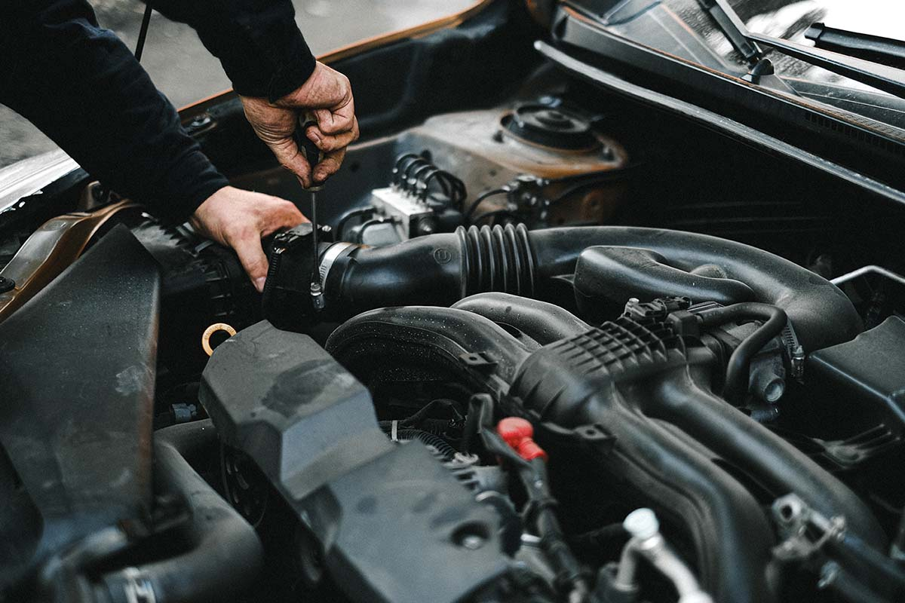

When it comes to maintaining a healthy lifestyle, we all know what to do. Regular doctor visits, healthy eating or even taking medicine or supplements are all ways to keep your body operating at optimal levels. Many people don’t consider themselves gear heads or engine experts, but if you think of your vehicle like the human body, you’ll find you already know almost everything there is to know.

## Prevention is key

If you think of your vehicle like your body, the engine is the heart. And to maintain a healthy heart, you need to be mindful of how you maintain it. Think of regular oil changes as the most important preventative medicine your car can get. With each oil change, fluids—such as transmission fluid and coolant—are checked and can be flushed, plus filters are checked and changed if needed. The lines to your engine are cleaned and fluids are topped off with fresh lubricant to keep your vehicle operating at top performance. And just like a doctor’s visit, our ASE-certified technicians are examining your vehicle’s overall condition, taking its vitals on the dash and alerting you of anything that needs attention.

## Damage and diagnoses

Just like with your health, if you neglect your vehicle, irreversible and often detrimental damage, can be the result. When preventative measures are not taken, signs of damage will likely arise and affect the performance of your vehicle, such as clicking, rumbling or shaking. Those are all signs of internal damage and may just be too late to fix. “This is why preventative maintenance is so important,” shared Matthews Tire Green Bay Store Manager Tom Winninghoff. “Another sign of internal damage is leaks. If you notice your vehicle is always running low on fluids—such as oil or coolant—but there’s never a puddle under your car, that substance is pooling in your engine.” And just like clogged arteries prevent the flow of healthy blood into the heart… clogged lines filled with debris also prevent the engine from operating properly, eventually causing your car to stall or fail altogether.

## Rely on the best

You would never gamble with your health. In fact, many people seek out the best and most experienced medical teams available when situations get serious. You should do the same with your vehicle! As your community’s premier automotive service provider, there is absolutely a “Matthews Tire Difference.” According to Tom, “We’re your partners in maintaining your vehicle. When you come in for an oil change, we’re going to check everything,” he explained, “all of your fluids, wipers, lights, brakes, tires, etc.” Matthews Tire will also email or text a very detailed and transparent breakdown after inspection. “We’ll also tell you about the good things,” Tom exclaimed. “If there are 60 things on a checklist that look good, you want to know that too. We’re not just focusing on what needs to be fixed, but rather, how to maintain a healthy vehicle overall.”

Is your vehicle due for a check-up? Experience the Matthews Tire difference at any of our convenient <a href="https://www.matthewstire.com/locations/">six locations</a>.
