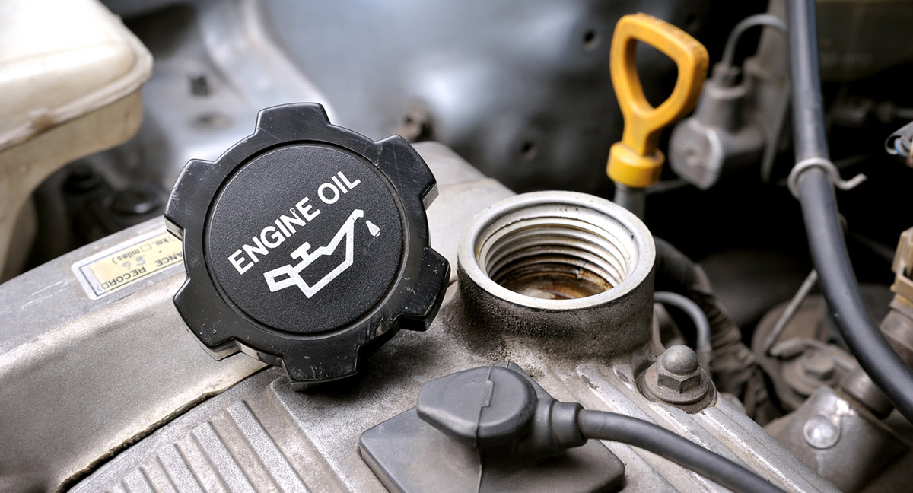

We've all been there … that moment when an orange flicker on your dash catches your eye while driving and reads, “service needed.” You begrudgingly admit, "I canNOT ignore this again. I must get an oil change." But the lazy, preoccupied and/or busier-than-ever side of you thinks, "What could it hurt to push it off a little longer?"

If this scenario sounds familiar, the good news is ... experts are extending the mileage intervals between oil changes now more than ever. Newer, more efficient vehicles and better oils even have manufacturers recommending oil changes every 5,000–7,500 miles. This change may offer enticing money-saving convenience for drivers, but other factors should be considered before you put the brakes on quarterly oil changes.

Traditionally, rule of thumb has been to service your vehicle every 3,000 miles or every three months (whichever comes first). Now, most vehicles are smart enough to tell you when an oil change is necessary and many people simply bring their vehicle in when the sensor activates. But what if you ignore that notification? Or don't notice right away? Or, you can't trust your vehicle to be as smart as a certified technician? While automatic notifications serve as nice reminders, "Matthews Tire technicians advise you to follow the manufacturers' recommendations," stated Menasha Matthews Tire Manager Craig Keberlein. “However, if you have extenuating circumstances, it's always safe to maintain the 'every 3,000 miles/three-month rule' for optimal vehicle performance.”

Aside from more efficient vehicles, more efficient oils are now available as well. Synthetic oil is more expensive—approximately double the price—but they can almost double the time between oil changes. Synthetic oil has other benefits too, Keberlein explained. "When tested under frigid temperatures, synthetic oil stands up better to the cold and eases the start-up of vehicles reducing engine wear."

Efficient vehicles and synthetic oil may help you gain more mileage between services, but there are still other factors to consider when reducing the frequency of oil changes:

- **Filter** – Synthetic oil may allow for longer intervals between oil changes, but your vehicle may not be designed for that. Consider your filter. You may need oil changes more frequently to prevent clogging or further damage.

- **Fluids** – Matthews Tire checks and tops off other fluids—such as wiper fluid—in your vehicle when you get an oil change. If you wait to have your car serviced, those fluids won’t be checked. You’ll either need to remember to refill them on your own, or you could run the risk of running out in between oil changes.

- **Oil** – If you stretch the intervals between service, check the oil periodically. It’s normal for even new vehicles to burn oil. If the oil gets too low, make sure to top it off to avoid engine damage.

Check with your local Matthews Tire technicians to determine what oil change frequency is best for your vehicle and lifestyle. Matthews Tire offers a variety of oil change options at affordable prices. “You won’t find a better price for the work we do,” Keberlein added. “In addition to changing the oil, our ASE-certified technicians perform a full vehicle inspection, plus we’ll top off all your fluids. Not every place will do that.”

Call or stop into your nearest Matthews Tire to schedule an oil change. Plus, [look to our Promotions page](https://matthewstire.com/promotions/) for a coupon featuring this month’s special offer on oil changes!
