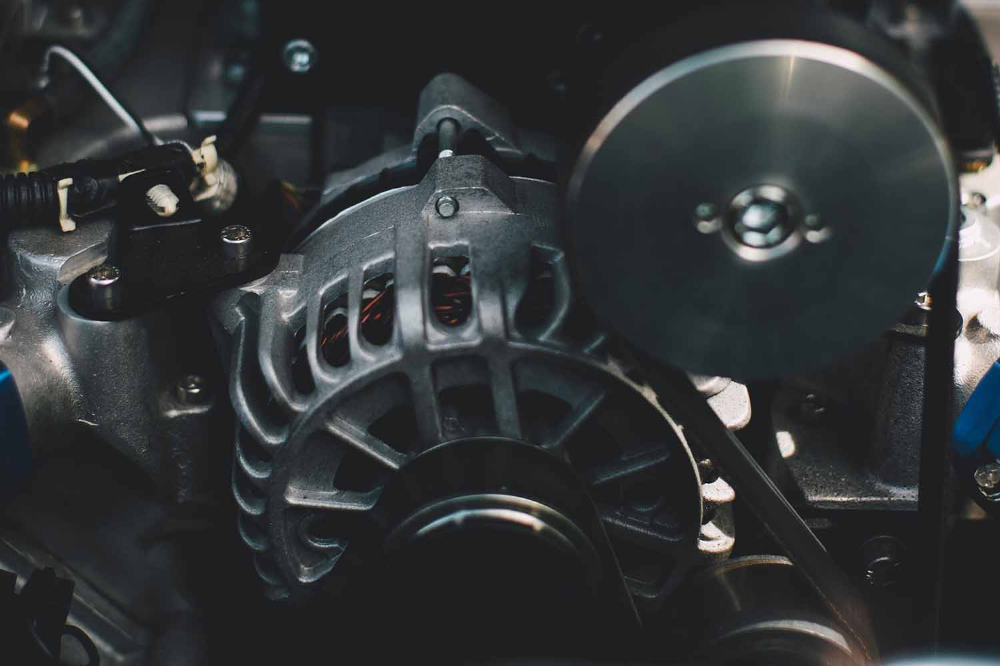

When people have trouble starting their vehicle, many blame the battery. Rarely do they consider the battery’s lesser-known—but equally instrumental—best friend, the alternator. The two work seamlessly together to keep your car running and are more dependent on each other than most people realize.

To understand how the battery and alternator work together, you should know the roles of each under the hood. Simply put, the battery starts your engine and runs the electrical dash components on your vehicle. The alternator, kicked in by the start of your battery, generates electricity to continuously power your battery. When the two are working properly, they achieve the perfect combination of power, creating a circuit of electricity that feeds itself for long-sustaining performance.

Over time, the wear and tear of one component can affect the other, and in most cases, a diagnosis of one or the other is very tricky. “If the alternator isn’t working properly, there can be premature battery failure,” Menasha Matthews Tire Manager Craig Keberlein shares. “Conversely, if your battery can’t start your car, the alternator simply won’t kick in.”

The fastest way to tell if a problem is caused by battery failure is to check the dashboard. If your battery light illuminates when starting your vehicle, that’s an instant way to draw a conclusion. However, Keberlein offers, not all diagnoses are that cut and dry. “The computers and technical components in vehicles are advancing more and more every day. Your alternator is controlled by a computer and it’s possible the problem could be occurring there,” he suggests.

How to ensure a healthy battery? First off, Keberlein advises, drive your car. “Some of our customers drive their cars very little and don’t start the engine frequently enough. They also don’t drive it long enough for the alternator to charge the battery.” If you’re concerned your stationary vehicle could lead to a dead battery, there are other methods for charging your battery. Matthews Tire can wire a battery tender (a tiny charger) directly to your battery ensuring your vehicle stays charged, long after sitting in the garage.

How to ensure a healthy alternator? A healthy battery, of course. The average life of battery is 4-5 years. Keep track of when you last changed the battery and make sure it stays charged.

If you experience car trouble and you think the battery or alternator could be the culprit, call your local Matthews Tire to take a look under the hood, test components and provide a definitive diagnosis. Matthews Tire offers a complete electrical system check for just $39.95. Call the [Matthews Tire location nearest you](https://matthewstire.com/locations/) to set up an appointment.
