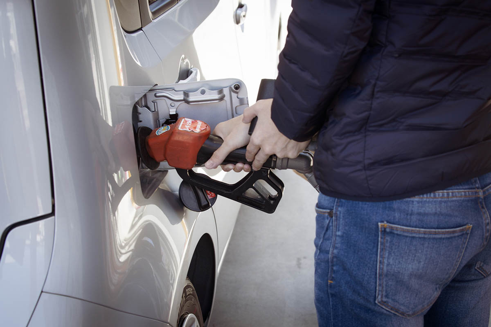

The weather is heating up, Memorial Day is quickly approaching and Wisconsinites are gearing up for the coming summer. Though this is usually the perfect time to pack up your car and head out on a road trip, recent rising gas prices may put a wrench in your plans. You don’t have to cancel your summer road trip just yet, though, thanks to our tips on how to improve your gas mileage.

Pulling from 40 years of experience in the automotive industry, Matthews Tire Manager Todd Steffes knows the ins and outs of how to increase fuel efficiency. Learn and implement his top five tips to be more fuel-efficient and save on gas this summer.

## Todd’s Fuel Efficiency Tips:

### Develop good driving habits

Yes, you can actually improve your fuel efficiency and save money on gas simply by being more mindful of your driving habits. According to Todd, the most important habits to develop to improve your gas mileage are maintaining a consistent speed and coasting to stops. “If you can plan how you drive, get off the gas and coast when you can,” Todd says, “it really makes a difference.”

### Measure tire pressure monthly

Regularly monitoring and maintaining your tires’ air pressure is essential to improve your gas mileage. Not only that, but it will also help to extend the life of your tires. According to Todd, more air in your tires will “keep them cooler and reduce rolling resistance,” putting less wear on your tires and greatly reducing your car’s fuel consumption.

### Follow a proper maintenance schedule

Keep your car in the best condition possible to ensure a mechanical issue isn’t negatively impacting your fuel efficiency. Todd recommends regularly replacing your engine’s air filter, spark plugs and brakes according to your owner’s manual maintenance schedule. He also notes that clogged fuel injectors can drastically increase your gas consumption, which you can prevent with a fuel injection cleaning service.

### Remove unnecessary weight

For a lesser-known fuel efficiency tip, Todd recommends giving your car a deep clean and removing any unnecessary clutter. You may be surprised by the number of items adding weight to your vehicle, from bike racks to golf bags, boxes and other miscellaneous clutter we all accumulate over time. Removing these items will reduce the carrying load of your vehicle and improve your overall gas mileage.

### Be mindful of the tires you use

Are you driving the best tires for your car? Todd notes that there are many styles and makes of tires and some will lead to more fuel consumption than others.

Lug-type tires, for example, are heavier and likely not the best choice if you want to save on gas. Rib-style tires, on the other hand, deliver the best fuel efficiency. If you aren’t quite sure which type of tires are best for your car and needs, [contact our experts](/contact/) for assistance.

## Improve Your gas Mileage

Don’t let rising gas prices put a damper on your summer. By implementing good driving habits and using the rest of Todd’s fuel efficiency tips, you can enjoy your summer without breaking the bank to pay for gas. To ensure your car is in perfect condition for maximum fuel efficiency, [schedule an appointment](/locations/) at Matthews Tire today!
