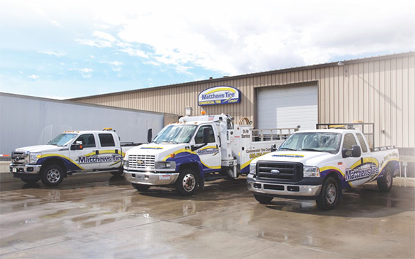

Matthews Tire is known throughout the Fox Valley and Green Bay surrounding area as a premier tire and auto maintenance service provider. What many do not know is that we also have a state-of-the-art commercial tire center to support the area’s businesses. Our Commercial Tire Center recently celebrated a 14-year anniversary of providing expertise, value and convenience to independent truckers, company fleets and municipalities.

"We service all kinds of truck, farm and OTR commercial vehicles," shared Commercial Tire Center Manager Paul Olson. "We provide a wide selection of tires including all major brands, but it’s our service that really sets us apart. All our technicians are manufacturer trained and certified."

With 24-hour emergency service, Matthews Tire is available—day or night—for all commercial tire concerns and solutions. "We'll provide roadside service in a pinch," assured Olson. "We want area businesses to know we're a reliable source to get things done quickly, because we know that time is money ... especially when it comes to commercial vehicles."

The Commercial Tire Center is equipped with innovative technology, such as computer spin balancing and automation, to get the job done efficiently. "This state-of-the-art equipment allows us to perform spin balancing with accuracy and ease. It's something that you don’t see everywhere," Olson shared. "It helps us get the job done right, and get you back on the road—and back to business—faster."

The Commerical Tire Center is located at [600 N. Bluemound Dr. in Appleton](https://www.google.com/maps/place/Matthews+Tire+%26+Auto+Center/@44.2678208,-88.4554433,15z/data=!4m5!3m4!1s0x0:0x5070eda600ae166d!8m2!3d44.2678208!4d-88.4554433?sa=X&ved=0ahUKEwiIwuPI767WAhXrhVQKHXJMChMQ_BIIhwEwCw) and is open Monday-Friday 7am-5pm and Saturdays 8am-noon.

Interested in learning more about our Commercial Tire Center? Call 920-735-0162 or [make an appointment online!](https://matthewstire.com/contact/)
