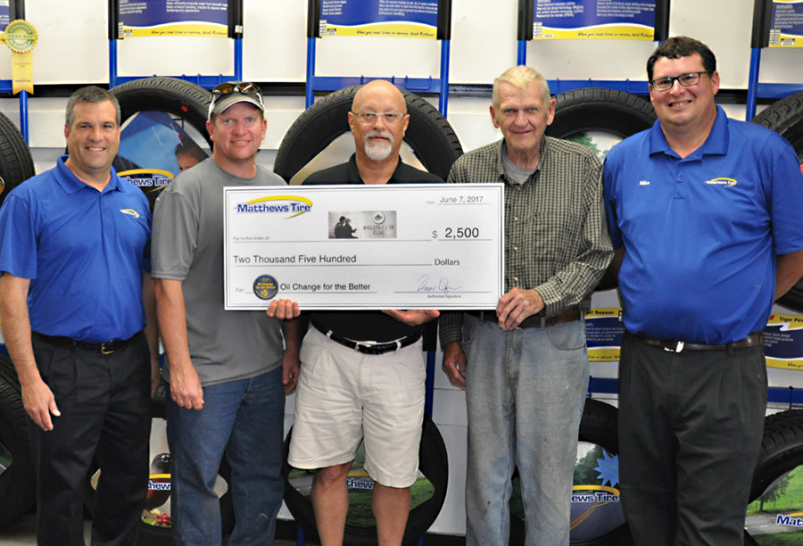

Matthews Tire President Trevor Rezner (left) and Matthews Tire Waupaca Store Manager Mike Marshall (right) present a $2,500 check to Walleyes for Kids board members: Roger Hansen (inner left), Mark Stange (middle), Gordon Schumacher (inner right).

Walleyes for Kids recently accepted a $2,500 donation from the Matthews Tire semi-annual _Oil Change for the Better_ event held May 15-20, 2017 at all six Matthews Tire locations. Matthews Tire tallied all regular priced oil changes performed throughout the week and pledged to donate $5 from each oil change to Walleyes for Kids, a non-profit organization that helps kids in need discover sports.

"We are very thankful for the support of Matthews Tire and _Oil Change for the Better_," said Walleyes for Kids President Mark Stange. "We are partnering with the UW-Oshkosh Fishing Team to host a fishing day for kids on June 24th. We are donating 50 fishing poles for the event. Support from generous businesses like Matthews Tire makes events like this possible."

Walleyes for Kids began with a few fishermen in Waupaca hoping to make a difference in the lives of children. What started as an annual fish fry, has evolved into a year-round initiative to introduce kids to organized sports and has also assisted in funding other activities such as equine therapy for abused children. In addition, Walleyes for Kids supplies fishing rod/reel combos for handing out to children lining parade routes every summer.

"Thank you to all of our customers who came out to Matthews Tire during _Oil Change for the Better_," shared Matthews Tire President Trevor Rezner. "We are proud to support Walleyes for Kids and we would not have been able to make such a contribution without the generosity of our loyal customers."

_Oil Change for the Better_ is a semi-annual, weeklong charity event held by Matthews Tire. This May was the tenth _Oil Change for the Better_ event. In the last five years, Matthews Tire has raised $25,000 for various local non-profits including Fox Valley Humane Society, Make-A-Wish Foundation, Salvation Army, Disabled American Veterans Transportation Program, Catalpa Health's Race for a Reason, Big Brothers Big Sisters, Old Glory Honor Flight, Saving Paws Animal Rescue and Walleyes for Kids.
