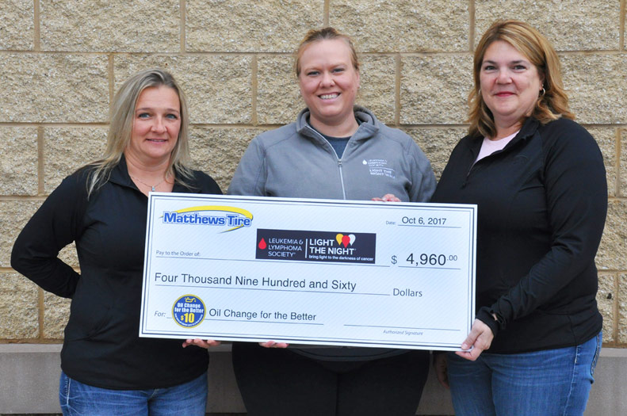

<small style="font-size:14px;">Matthews Tire Office Administrator Jennifer Brockman (left) and Matthews Tire Controller Debbie Duesing (right) present a $4,960 check to Leukemia and Lymphoma Society’s local <i>Light the Night</i> Campaign Manager Megan Kreuter (middle).</small>

A local representative from the Leukemia and Lymphoma Society recently accepted a $4,960 donation from Matthews Tire. The money was raised during our semi-annual Oil Change for the Better event held September 25-30, 2017 at all six locations. Matthews Tire tallied all regular priced oil changes performed throughout the week and pledged to donate $10 from each oil change to the Leukemia and Lymphoma Society’s <i>Light the Night</i> walk in Appleton.

"We really appreciate the commitment that Matthews Tire has made to provide us with this donation," said <i>Light the Night</i> Campaign Manager Megan Kreuter. "This will go a long way in so many areas. It will help support our local patients and their caregivers, as well as help us with advocacy and to raise the voices in the fight against blood cancer."

Part of a nationwide effort, Appleton’s <i>Light The Night</i> took place Friday, Oct. 6 at Neuroscience Group Field at Fox Cities Stadium on Casaloma Drive. “Oil Change for the Better is a great opportunity for our entire staff to give back,” shared Matthews Tire Controller Debbie Duesing. "Everyone feels good knowing that they are working to give a meaningful donation and spread the word about a really special event." In 2016, the LLS's <i>Light The Night</i> walk raised over $68.5 million nationally for research and patient services. Participants walk along a two-mile route, carrying illuminated lanterns—white for survivors, red for supporters, and gold for in memoriam.

Oil Change for the Better is a semi-annual, weeklong charity event held by Matthews Tire. This September’s Oil Change for the Better was Matthews 11th fundraising event in six years. Matthews Tire has raised over $30,000 for various local non-profits including Fox Valley Humane Society, Make-A-Wish Foundation, Salvation Army, Disabled American Veterans Transportation Program, Catalpa Health’s Race for a Reason, Big Brothers Big Sisters, Golden House, Old Glory Honor Flight, Saving Paws Animal Rescue, Walleyes for Kids and the Leukemia and Lymphoma Society’s <i>Light the Night</i> walk.
