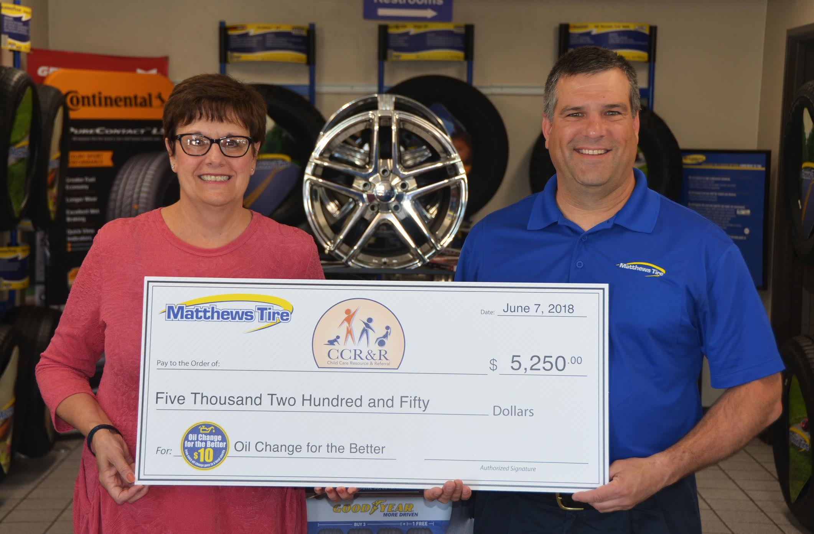

<small style="font-size:14px;">Child Care Resource and Referral Executive Director Judith Olson (Left) accepts a $5,250 donation from Matthews Tire President Trevor Rezner (Right).</small>

Child Care Resource and Referral (CCR&R) Executive Director Judith Olson recently accepted a $5,250 donation from Matthews Tire. The money was raised during the Matthews Tire semi-annual _Oil Change for the Better_ event held May 14-19, 2018 at all six locations. Matthews Tire tallied all regular priced oil changes performed throughout the week and pledged to donate $10 from each oil change to Child Care Resource and Referral of the Fox Valley.

“We are very thankful for the support from Matthews Tire through their Oil Change for the Better event,” said Child Care Resource and Referral Executive Director Judith Olson. “The funds raised will allow us to subsidize training for over 200 early child care teachers in our local communities.”

CCR&R provides professional development training to child care teachers on a variety of topics, allowing them to enhance their knowledge in working with young children. “Research shows that 90% of a child’s potential is determined by age five, which means early educators play a significant role in young children’s development.” adds Olson. “The quality of early education depends on the skills of the adults who care for young children and the relationships they form. CCR&R strives to assist these early child care teachers with opportunities that will help them guide children toward success in the future.”

_Oil Change for the Better_ is a semi-annual, weeklong charity event held by Matthews Tire. This May’s _Oil Change for the Better_ was Matthews Tire’s 12th fundraising event in seven years. Matthews Tire has raised over $35,000 for various local non-profits including Fox Valley Humane Society, Make-A-Wish Foundation, Salvation Army, Disabled American Veterans Transportation Program, Catalpa Health’s _Race for a Reason_, Big Brothers Big Sisters, Golden House, Old Glory Honor Flight, Saving Paws Animal Rescue, Walleyes for Kids, the Leukemia and Lymphoma Society’s _Light the Night_ walk, and Child Care Resource and Referral of the Fox Valley.
