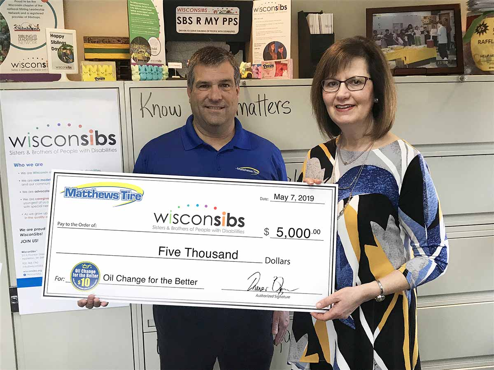

WisconSibs Executive Director Harriet Redman recently accepted a $5,000 donation from Matthews Tire after their 14th semi-annual **_Oil Change for the Better_** event. The event was held April 22-27, 2019 at all six Matthews Tire locations. For every regular priced oil change performed throughout the week, Matthews Tire pledged to donate $10 to WisconSibs.

“Matthews Tire and their Oil Change for the Better event helps keep our programs running,” said WisconSibs Executive Director Harriet Redman. “We appreciate this donation and the ongoing support from our community!”

The donation will help support WisconSibs summer camp programs and other new initiatives to serve siblings of kids with disabilities, Redman confirmed. The summer camp programs encourage kids to participate in a variety of outdoor activities while making friends who share the challenges and joys of being a sibling.

**_Oil Change for the Better_** is a semi-annual, weeklong charity event held by Matthews Tire. This April was Matthews Tire’s 14th fundraising event in seven years. Matthews Tire has raised over $45,000 for various local non-profits including Fox Valley Humane Society, Make-A-Wish Foundation, Salvation Army, Disabled American Veterans Transportation Program, Catalpa Health’s _Race for a Reason_, Big Brothers Big Sisters, Golden House, Old Glory Honor Flight, Saving Paws Animal Rescue, Walleyes for Kids, the Leukemia and Lymphoma Society’s _Light the Night_ walk, Child Care Resource and Referral of the Fox Valley, SOAR Fox Cities and now, WisconSibs.
