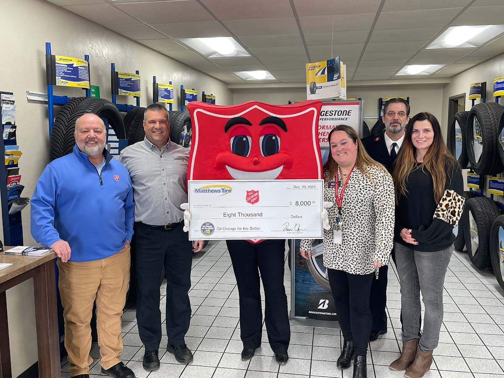

Representatives from The Salvation Army (TSA) accepted an $8,000 check from Matthews Tire. Pictured left to right: TSA Waupaca County Business Administrator Ken Tregellas, Matthews Tire President Trevor Rezner, TSA Greater Green Bay Volunteer & Special Events Coordinator Renee Main (in mascot), TSA Greater Green Bay Community Relations & Marketing Coordinator Nicole Hanley, TSA Fox Cities Commanding Corp Officer & Major David Minks, TSA Fox Cities Director of Development & Marketing Communications Kristal Knudtson

The Salvation Army accepted an $8,000 check from Matthews Tire after our 18th **_Oil Change for the Better_** event held Dec. 6-11, 2021 at all six locations.

Major David Minks, commanding corp officer for The Salvation Army Fox Cities, accepted the check on behalf of The Salvation Army groups throughout Northeast Wisconsin. “We would like to share our appreciation to Matthews Tire,” he shared. “Its impact is changing so many lives in our community. This will bring food and shelter to the hurting homeless population as well as Christmas toys and smiles.”

For every regular-priced oil change performed throughout the week at all six locations (in Appleton–East and West, Menasha, Waupaca, Fond du Lac and Green Bay), Matthews Tire donated $15 to The Salvation Army. They also collected toys in Matthews Tire lobbies throughout the week just in time for Christmas.

“We’re proud to support The Salvation Army and the important work they do in Northeast Wisconsin,” shared Trevor Rezner, president of Matthews Tire. “Their local presence in our communities supports so many kids and families in need and we’re grateful to be a part of that.”

**The Salvation Army** annually helps nearly 23 million Americans overcome poverty, addiction and economic hardships through a range of social services. By providing food for the hungry, emergency relief for disaster survivors, rehabilitation for those suffering from drug and alcohol abuse, and clothing and shelter for people in need, The Salvation Army is doing the most good at 7,600 centers of operation around the country. In the first-ever listing of “America’s Favorite Charities” by _The Chronicle of Philanthropy_, The Salvation Army ranked as the country’s largest privately funded, direct-service nonprofit. For more information, visit <a href="https://www.salvationarmyusa.org/usn/" target="_blank" rel="noopener noreferrer">SalvationArmyUSA.org</a>. Follow us on Twitter @SalvationArmyUS and #DoingTheMostGood.

**_Oil Change for the Better_** is a semi-annual weeklong charity event held by Matthews Tire. This December was the 18th **_Oil Change for the Better_** event. Since 2012, Matthews Tire has raised over $73,000 for various local nonprofits including Fox Valley Humane Society, Make-A-Wish Foundation, The Salvation Army, Disabled American Veterans Transportation Program, Catalpa Health’s Race for a Reason, Big Brothers Big Sisters, Old Glory Honor Flight, Saving Paws Animal Rescue, Walleyes for Kids, Leukemia and Lymphoma Society, Child Care Resource & Referral, SOAR Fox Cities, WisconSibs, Breast Cancer Family Foundation, a variety of local food pantries and Wisconsin Veterans Village Association.

Did you miss **_Oil Change for the Better_**? You can still donate to your local branch of The Salvation Army!

<a href="http://www.salvationarmywi.org/" target="_blank" rel="noopener noreferrer" class="btn btn-primary btn-small">Donate Now</a>
