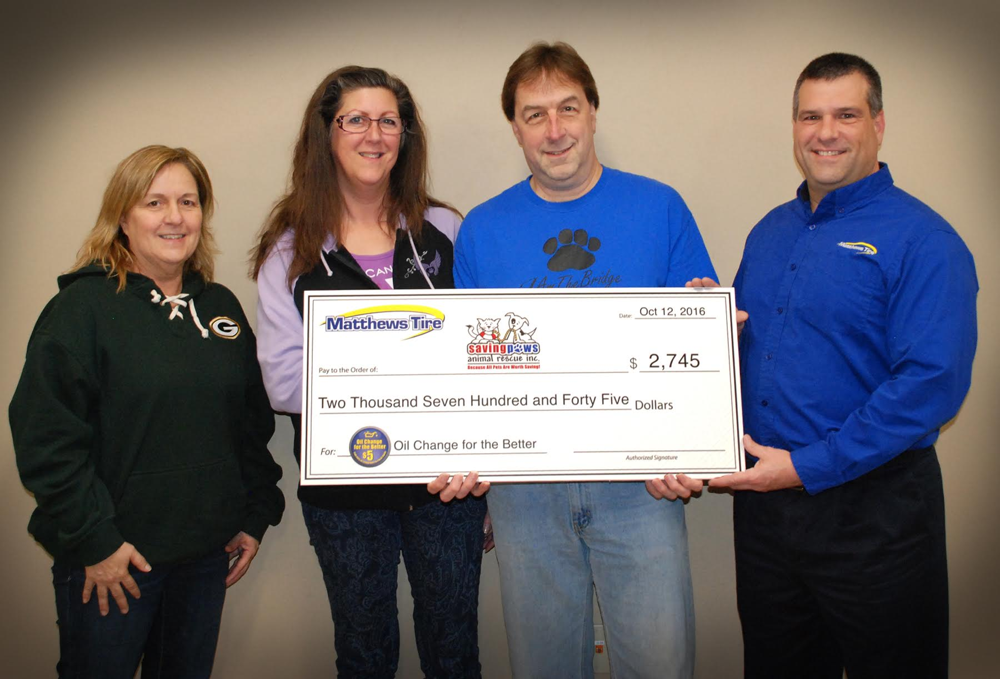

LEFT TO RIGHT: Glenda Stadler-Co-Director of Saving Paws, Lori and Mike Smith-Dog trainers and foster caretakers, Trevor Rezner-President of Matthews Tire

During the fall **_Oil Change for the Better_** event, held September 19-24, 2016 at all Matthews Tire™ retail locations, $2,745 was raised for [Saving Paws Animal Rescue Inc.](http://www.savingpaws.com/) Saving Paws is a local non-profit animal rescue that primarily cares for rescued, abandoned or surrendered cats and dogs, as well as trains service dogs to assist children, adults and veterans with disabilities. They also seek to decrease the number of unwanted animals and animal cruelty in the community through outreach and education.

During **_Oil Change for the Better_**, Matthews Tire donated $5.00 from every regularly priced oil change to benefit this worthy cause. They completed 549 oil changes for a total donation of $2,745.

“Because of the support from local businesses like Matthews Tire, we’re able to care for animals in our community,” said Saving Paws Co-Director Glenda Stadler. “We are very thankful for this donation; it will really go a long way.”

The donation is ear marked to support the [S.P.A.R.K.E.D program](http://www.savingpaws.com/s-p-a-r-k-e-d-program)&mdash;a program at Saving Paws that supports service dogs in training. It also helps eliminate the waiting period for providing a service dog to people with disabilities and strives to reduce the cost to the individual.

“By training and placing quality, specifically trained service dogs&mdash;who have been rescued&mdash;the program truly enriches the lives of people with disabilities,” Stadler added. “With a service dog by their side, many disabled individuals are able to work and reach new goals with dignity and independence.”

A HUGE thank you to everyone who lent a helping paw and got an oil change during this wonderful week!
