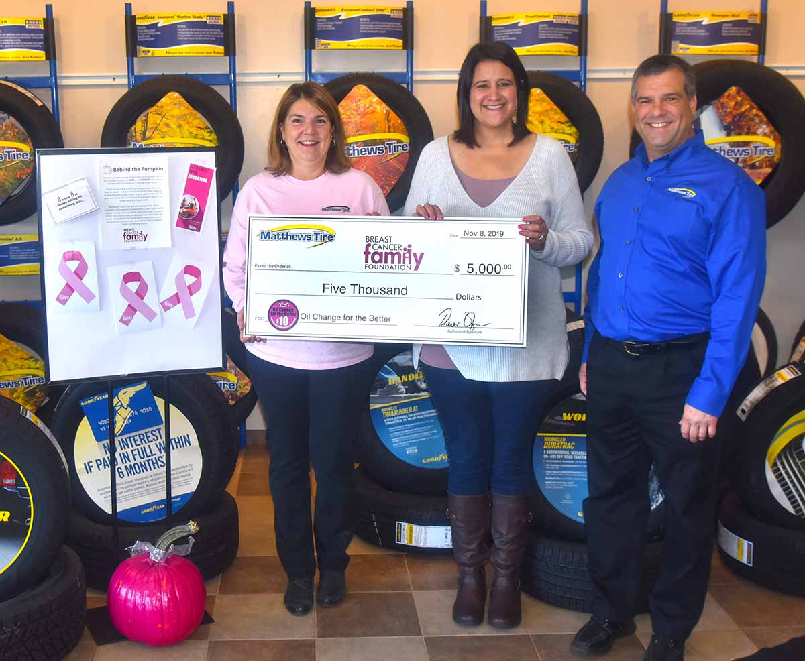

Breast Cancer Family Foundation Executive Director Diane Gaywont (<em>middle</em>) accepts a $5,000 donation from Matthews Tire Vice President/HR Manager Debbie Duesing (<em>left</em>) and President Trevor Rezner (<em>right</em>).

The Breast Cancer Family Foundation Executive Director Diane Gaywont recently accepted a $5,000 donation from Matthews Tire after their 15th semi-annual **_Oil Change for the Better_** event. The event was held October 21-26, 2019, at all six Matthews Tire locations. For every regular priced oil change performed throughout the week, Matthews Tire pledged to donate $10 to the Breast Cancer Family Foundation.

“Matthews Tire and their Oil Change for the Better event help keep our programs running,” said the Breast Cancer Family Foundation Executive Director Diane Gaywont. “This generous donation will enable our foundation to reach even more students with our mission of creating a healthy cancer-free lifestyle. Our goal is to reach 15,000 students in 2020. This donation will help ensure we get there! Together, we are changing the ending to the story on cancer.”

The donation will help support the Breast Cancer Family Foundation’s middle school and high school programs, Gaywont confirmed. The programs help kids get answers to the tough questions they may have about cancer and provide a healthy dialogue for them, along with offering children great suggestions for things they can do to prevent cancer.

**_Oil Change for the Better_** is a semi-annual, weeklong charity event held by Matthews Tire. This October was Matthews Tire’s 15th fundraising event in seven and a half years. Matthews Tire has raised over $50,000 for various local non-profits including Fox Valley Humane Society, Make-A-Wish Foundation, Salvation Army, Disabled American Veterans Transportation Program, Catalpa Health’s _Race for a Reason_, Big Brothers Big Sisters, Golden House, Old Glory Honor Flight, Saving Paws Animal Rescue, Walleyes for Kids, the Leukemia and Lymphoma Society’s _Light the Night_ walk, Child Care Resource and Referral of the Fox Valley, SOAR Fox Cities, WisconSibs and now, the Breast Cancer Family Foundation.
