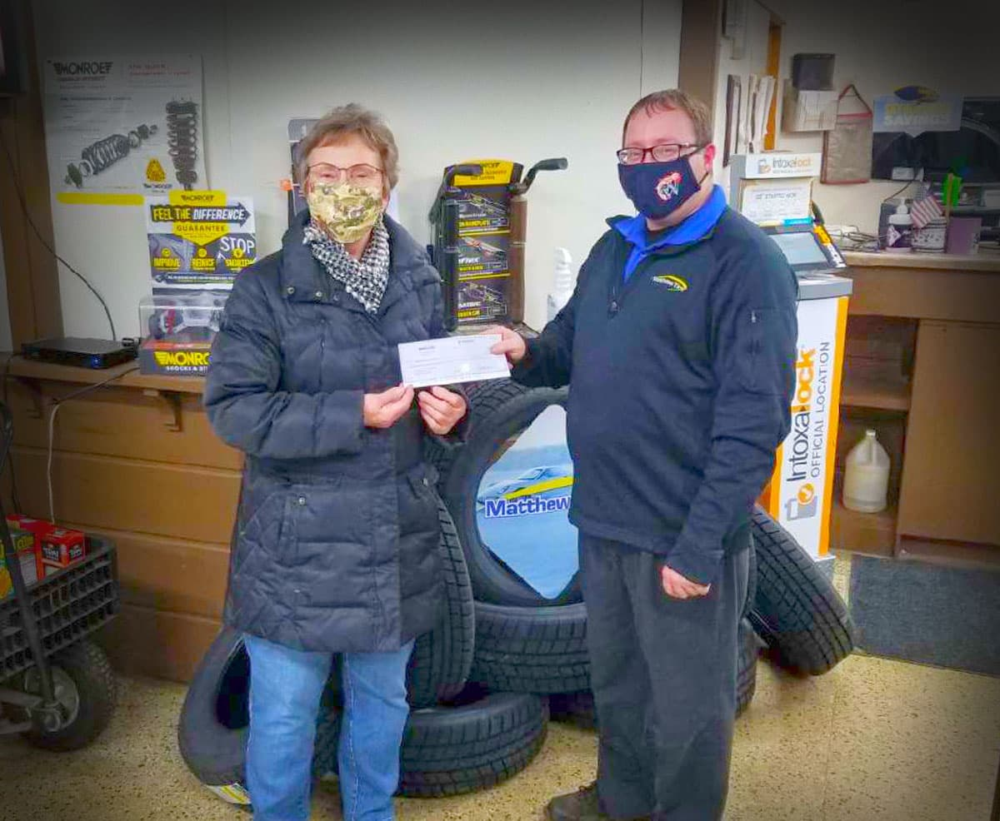

Pictured above: Waupaca Area Food Pantry Board President Linda Holtebeck accepts a donation from Matthews Tire.

Six area food pantries recently accepted monetary and food donations from Matthews Tire’s 16th _**Oil Change for the Better**_ event, held Nov. 16-21 at all six of our locations. During the event, a total of $7,500 was raised and split evenly between <a href="https://www.freedom-from-hunger.org/" target="_blank" rel="noopener noreferrer">Freedom Center Food Pantry</a> in Appleton, <a href="https://www.facebook.com/heartofthevalleyfoodpantry/" target="_blank" rel="noopener noreferrer">Heart of the Valley Food Pantry</a> in Appleton, <a href="https://www.paulspantry.org/" target="_blank" rel="noopener noreferrer">Paul’s Pantry</a> in Green Bay, <a href="https://www.stjoesfoodprogram.org/" target="_blank" rel="noopener noreferrer">St. Joseph Food Program</a> in Menasha, <a href="https://www.fondyfoodpantry.org/" target="_blank" rel="noopener noreferrer">Fondy Food Pantry</a> and <a href="https://www.facebook.com/waupacafoodpantry/" target="_blank" rel="noopener noreferrer">Waupaca Area Food Pantry</a>.

“We are so appreciative of Matthews Tire for all of the support over the years,” St. Joseph Food Program Director of Marketing and Development Kendra Schmidt shared. “You [Matthews Tire] and your customers are so generous, especially during these difficult times.”

For every regular priced oil change performed during _**Oil Change for the Better**_, Matthews Tire pledged to donate $15 to a local food pantry. According to Feeding America, the pandemic has resulted in a greater need for food pantries in our area. That’s why, for this event, Matthews Tire increased the donation amount from $10 to $15 per oil change, plus added food collection baskets at all locations.

“As an organization that relies 100% on the generosity of the community, donations like this help keep us going,” said Paul’s Pantry Assistant Director Bob Hornacek. “We truly could not do what we do without the support of places like Matthews Tire. There is a great need in our community. But we are overwhelmed with the generosity we witness every day. Thank you to Matthews Tire for the support!”

_**Oil Change for the Better**_ is a semi-annual, weeklong charity event held by Matthews Tire. This November was our 16th fundraising event in eight years. Matthews Tire has raised almost $58,000 for various local non-profits including Fox Valley Humane Society, Make-A-Wish Foundation, Salvation Army, Disabled American Veterans Transportation Program, Catalpa Health’s Race for a Reason, Big Brothers Big Sisters, Golden House, Old Glory Honor Flight, Saving Paws Animal Rescue, Walleyes for Kids, the Leukemia and Lymphoma Society’s Light the Night walk, Child Care Resource and Referral of the Fox Valley, SOAR Fox Cities, WisconSibs, the Breast Cancer Family Foundation, and now, six local food pantries.

**Did you miss _Oil Change for the Better_? You can still donate non-perishable foods, money or your time to a pantry near you!**
