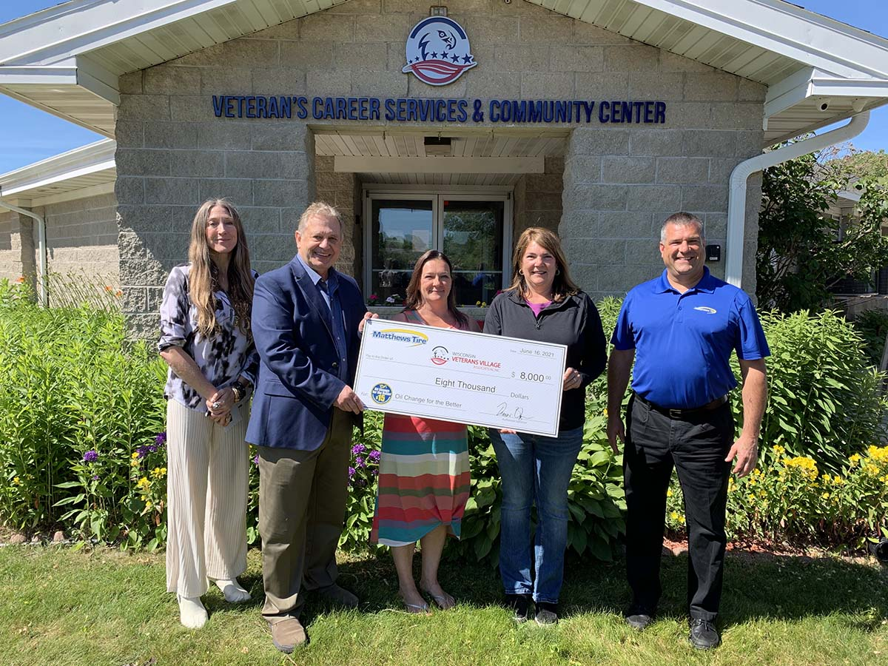

(Left to right) Wisconsin Veterans Village Association Director of Development Kimberly Massey and Executive Director John Maino, Matthews Tire Vice President/Controller Jennifer Brockman, Vice President/HR Manager Debbie Duesing and President Trevor Rezner

Matthews Tire donated a total of $8,000 to the Wisconsin Veterans Village Association after the 17th _**Oil Change for the Better**_ event, held May 24-28 at all six locations.

“We have big plans for helping to bring veterans together as a community here,” Executive Director John Maino shared. “This money doesn’t go to overhead or to pay salaries. It goes directly to the veterans and to their experience. It’s grassroots efforts like this that make what we do possible. Thank you.”

For every regular priced oil change performed during _**Oil Change for the Better**_, Matthews Tire pledged to donate $15 to the Veterans Village. Money raised through _**Oil Change for the Better**_ will support the Goodwill Industries of North Central Wisconsin (NCW) Veteran’s Career Services & Community Center located within the Veterans Village which helps residents secure employment and financial support.

“This Oil Change for the Better resulted in our highest donation yet,” said Trevor Rezner, president of Matthews Tire. “After touring the Veterans Village myself, I am excited and proud to support the growth of this hidden gem right down the street.”

_**Oil Change for the Better**_ is a semi-annual, weeklong charity event held by Matthews Tire. This May was Matthews Tire’s 17th fundraising event in nine years. Matthews Tire has raised $65,955 for various local non-profits including Fox Valley Humane Society, Make-A-Wish Foundation, Salvation Army, Disabled American Veterans Transportation Program, Catalpa Health’s _Race for a Reason_, Big Brothers Big Sisters, Golden House, Old Glory Honor Flight, Saving Paws Animal Rescue, Walleyes for Kids, the Leukemia and Lymphoma Society’s _Light the Night_ walk, Child Care Resource and Referral of the Fox Valley, SOAR Fox Cities, WisconSibs, the Breast Cancer Family Foundation, six local food pantries and now, Wisconsin Veterans Village Association.

**Did you miss _Oil Change for the Better_?**

You can still donate to the Wisconsin Veterans Village Association at <a href="https://www.wisvva.org/" target="_blank" rel="noopener noreferrer">wisvva.org</a>.
