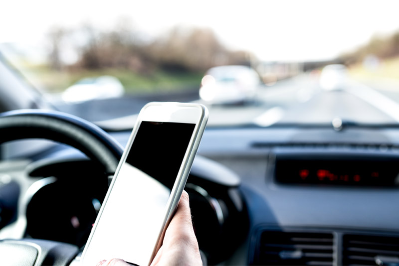

Next time you’re commuting, driving the kids to school or simply running errands, glance at the drivers beside you. How many are on their phones? It can be a disturbing observation when you take the time to notice it. Though vehicle manufacturers continue to advance hands-free technology to eliminate mobile device usage while driving, it just doesn’t seem to be enough.

For this reason, the National Safety Council (NSC) declared April Distracted Driving Awareness Month to draw attention to the severity of this issue. According to NSC, distracted driving kills more than 3,000 people each year or about eight people every day. It takes the lives of people in all age groups, particularly teens. Car crashes are the number one cause of preventable death for teenagers.

## Matthews Tire encourages drivers to take advantage of NSC’s free resources today to help save lives tomorrow:

- The NSC DriveitHOME initiative helps teens build experience behind the wheel. <a href="https://cloud.safe.nsc.org/driver-deal" target="_blank" rel="noopener">The New Driver Deal</a> is a parent-teen driving agreement, and <a href="https://cloud.safe.nsc.org/pointers-for-parents#_ga=2.176240549.1033100282.1649954110-1765070071.1649954110" target="_blank" rel="noopener">Pointers for Parents</a> is a comprehensive collection of driving lessons designed around the changing experience levels of teen drivers.
- Download the free report, <a href="https://cloud.safe.nsc.org/2020-ddam-understanding-driver-distraction-white-paper#_ga=2.157175736.222068285.1648743193-1307803252.1648743193" target="_blank" rel="noopener">Understanding Driver Distraction</a>, which offers compelling evidence and concludes the safest option is to eliminate driver use of cell phones and interactive, in-vehicle infotainment systems. The report also includes recommendations for drivers, employers, legislators and manufacturers.
- Take the <a href="https://www.nsc.org/faforms/ddam-pledge" target="_blank" rel="noopener">NSC Just Drive Pledge</a> and commit to driving distraction-free.
- <a href="https://www.nsc.org/pages/ddam/donation-form" target="_blank" rel="noopener">Donate to NSC</a> to help make roads safer for everyone.
- Understand that <a href="https://www.nsc.org/workplace/resources/infographics/the-great-multitasking-lie" target="_blank" rel="noopener">multitasking is a myth</a>, and there is <a href="https://www.nsc.org/getmedia/2ea8fe8b-d7b7-4194-8ea5-306d30a73972/cognitive-distraction-white-paper.pdf" target="_blank" rel="noopener">no safe way to use a cell phone while driving</a>.
- Visit <a href="https://www.nsc.org/road/distracted-driving-awareness-month" target="_blank" rel="noopener">nsc.org/justdrive</a> for ready-to-use resources to share in your workplace and community.
- If someone you know was killed or seriously injured in a distracted driving-related crash, please consider joining <a href="https://www.nsc.org/our-impact/nsc-survivor-advocate-network" target="_blank" rel="noopener">the NSC network of survivor advocates</a>. Safety is personal, and NSC wants to help share your story to save lives.

## About the National Safety Council

The National Safety Council is America’s leading nonprofit safety advocate – and has been for over 100 years. As a mission-based organization, we work to eliminate the leading causes of preventable death and injury, focusing our efforts on the workplace, roadway and impairment. We create a culture of safety to not only keep people safer at work, but also beyond the workplace so they can live their fullest lives.
