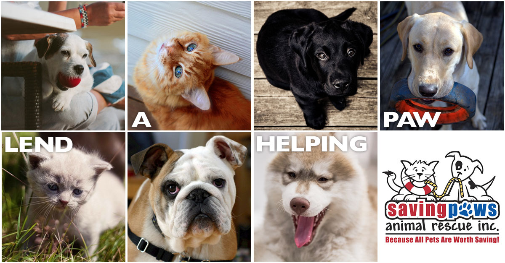

At Matthews Tire, we’re hosting our 9th _Oil Change for the Better_ event September 19-24 at all six locations! For every regular price oil change performed, we’ll donate $5 to [Saving Paws Animal Rescue Inc.](http://www.savingpaws.com/) This choice of charity is especially timely, as September is National Guide Dog Month.

Saving Paws is a local non-profit animal rescue that cares for rescued, abandoned or surrendered cats and dogs, as well as trains service dogs to assist children, adults and veterans with disabilities. They also seek to decrease the amount of unwanted animals and animal cruelty in the community through outreach and education.

“Matthews Tire is proud to support an organization that makes a positive impact in our community,” said Trevor Rezner, Matthews Tire President. “Their dedicated volunteers and life-changing programs are what make Saving Paws unique.”

_Oil Change for the Better_ is Matthews Tire’s semi-annual, weeklong charity event. In the last four years, we’ve raised more than $17,000 for various local charities including Old Glory Honor Flight, Make-A-Wish Foundation, the Salvation Army and more.

Schedule an appointment and help local animals in need!
