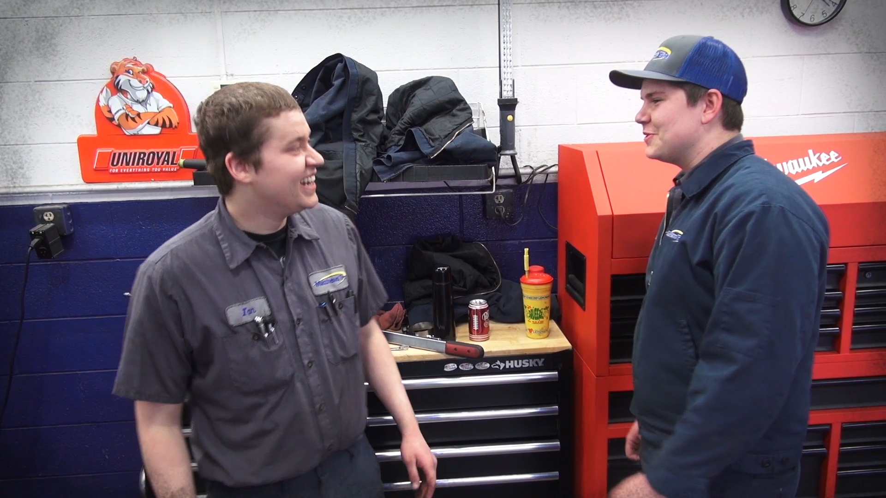

Ian loves working at Matthews Tire and you could too! We are always looking for hard-working, experienced general service technicians or recent grads excited to learn more. Matthews Tire offers a family atmosphere, quality equipment, a safety-first attitude, training and fair compensation. <a href="https://matthewstire.com/careers/">Visit our careers page</a> and explore a career with Matthews Tire!

&nbsp;

