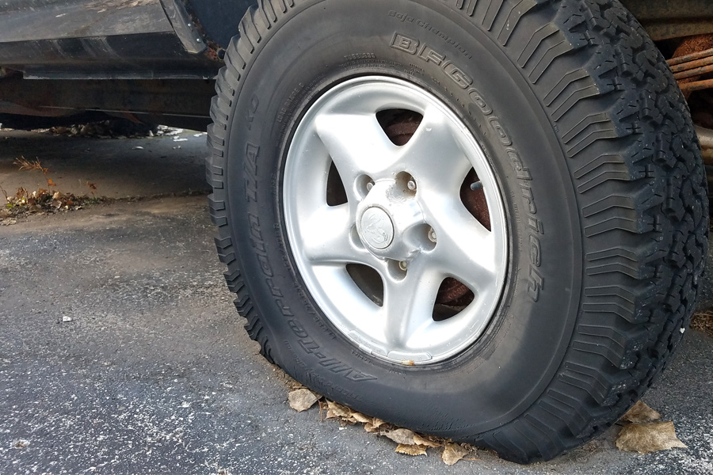
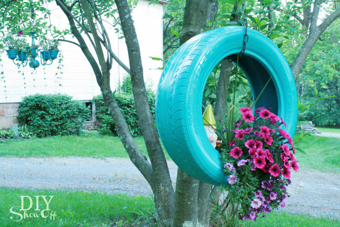
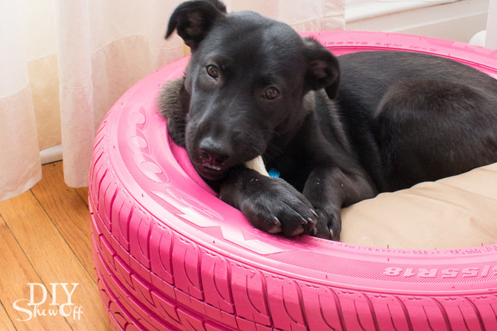

When you get new tires on your car at Matthews Tire, the old ones become recycled products used throughout the country.

Winter is coming and you know it’s time to replace your tires. At Matthews Tire, we make sure you drive off with the right tires and we do the right thing when we properly recycle your old tires.

For the past 27 years, we’ve been recycling our waste tires with [Liberty Tire Recycling](http://libertytire.com/). Liberty recycles over 35% of the nation’s waste tires each year.

"Recycling tires is important because they're nearly indestructible," says Don Hacker, inbound sales manager at Liberty Tire. "Even though tire rubber is inert like most plastic materials, it resists degrading and will be around for many years if not recycled properly."

So what is the best way to recycle waste tires? Hacker explains Liberty Tire’s recycling process:

1. Collect waste tires from customers nationwide
2. Sort waste tires into two groups: tires/parts that can be repurposed and tires/parts that can go straight to the recycling process
3. Shred into pieces (remove nearly all of the steel from the pieces)
4. Screen and separate rubber pieces based on the size of the particles and cull out the steel

Matthews Tire's waste tires are turned into the highest quality ground tire rubber. From landscaping to playgrounds, these tires become consumer mulch products under the [GroundSmart](http://www.groundsmartrubbermulch.com/)&reg; brand name. Since it doesn’t decompose or blow away, recycled tire rubber keeps artificial playing surfaces safe. It's also non-toxic and doesn’t harbor insects or mold.

According to Liberty Tire, "Recycled tire rubber used in artificial turf or as a playground surface poses no significant health or environmental risk. A six-inch layer of rubber safety surfacing can cushion a child’s fall from as high as sixteen feet."

Matthew's Tire is proud to recycle waste tires and benefit communities across the nation at the same time. Interested in repurposing your old tires yourself? Check out these three do-it-yourself projects for any time of the year:

Planters - [Get step-by-step instructions here](http://diyshowoff.com/2013/07/02/diy-tire-planter-tutorial/).

Outdoor Décor - [Get step-by-step instructions here](http://hative.com/creative-ways-to-repurpose-old-tires/).

Pet Bed - [Get step-by-step instructions here](http://www.practicallyfunctional.com/diy-dog-bed-from-a-recycled-tire/).

**And remember, if you have any questions about your automotive needs, don’t hesitate to call the pros at Matthews Tire!**
