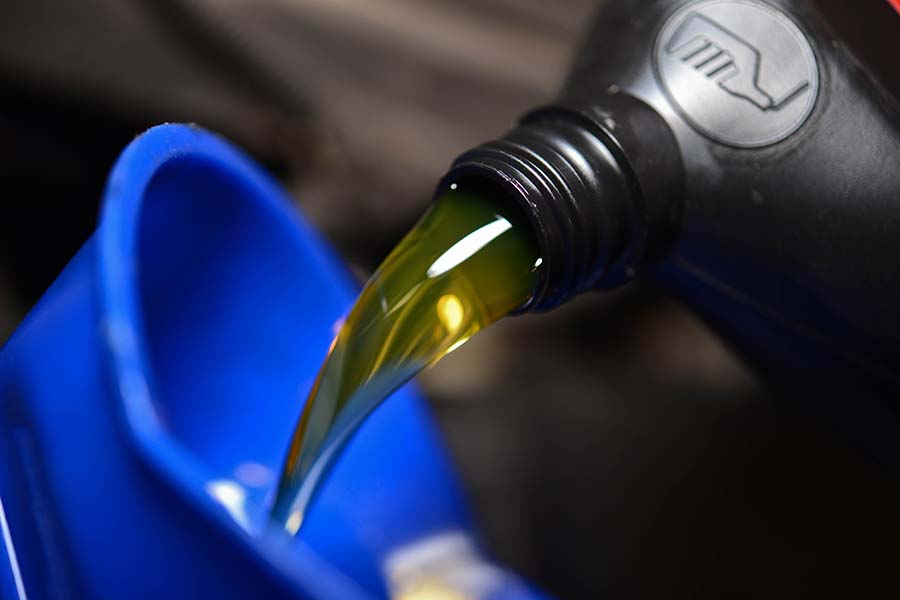

At the start of the New Year it seems everyone is jumping on the healthy living bandwagon. From extreme workouts to fad diets, fasting and popular cleanses, people want the best for their bodies! Well, you should want the best for your car too. With a “vehicle cleanse” you may find achieving overall engine health is quite simple. It’s like making sure your car is drinking those green meal replacement shakes—only much easier, with proven results!

## “Detox” your vehicle with these four common flushes:  

**1. Oil Change** – The most common preventative maintenance is an oil change. It’s the vehicle’s equivalent to flossing. Everyone knows they should do it, that it contributes to overall health, but they probably don’t do it as much as they should. During a routine oil change, the technician will flush old oil from the engine, replace it with fresh oil, and also replace the filter. Regular oil changes extend the life of your vehicle, ensure it runs smoothly and prevent clogs that could lead to further damage. The good news is, new synthetic oils are prolonging time in between oil changes meaning less time in the shop and more time on the road. Although, Matthews Tire’s expert technicians recommend that you follow the manufacturer’s recommendations for scheduling oil changes.

**2. Radiator Flush** – A cooling system, coolant or radiator flush, is especially top of mind during extreme weather but should be a regular part of your vehicle’s preventative maintenance. While the procedure has many names, it’s not complicated. A technician can perform a fluid exchange to drain old coolant, run a cleansing solution through the cooling system to flush out rust or debris, and then replace it with new coolant. This preventative maintenance is important to the overall functionality of your vehicle’s heating and cooling system. More importantly, it prevents overheating which can cause substantial and costly engine damage. Have your coolant checked or changed according to the recommendations in your manufacturer’s guidelines.

**3. Fuel System Flush** – Your vehicle’s fuel system, comprised of the intake, valves, injectors and pistons, run fuel to the engine. When the system hasn’t been flushed for some time, debris, such as carbon, can build up and disperse throughout the system affecting other parts of the vehicle. This can affect engine performance, gas mileage and can even lead to engine failure. A fuel system cleanse purges old fluid and replaces it with a cleanser to breakdown deposits and flush out other sediment. This is especially important if you use low-grade fuel. Depending on the condition of the vehicle, the technician may also lubricate valves, cylinders, injectors and rings to prevent corrosion and increase efficiency. Matthews Tire typically recommends fuel system flushes annually, but you should always consult the manufacturer’s recommendations.

**4. Brake Fluid Flush** – A brake fluid flush is not needed as often as other flushes but is one of the most important. No one wants to discover their brakes are compromised while on the road! Most manufacturers recommend a brake fluid flush about every 30,000-45,000 miles or every two years. A technician will simply flush out the old dirty brake fluid, then replace it with new clean brake fluid. It is most important to flush brake fluid because moisture in the system can lead to rust and other debris that reduces performance and your ability to stop! A regular brake fluid cleanse—in combination with regular brake system inspections—will ensure you’ll keep rolling (and stopping) at your leisure.

Get started on a “vehicle cleanse” today! <a href="http://matthewstire.com/locations/">Stop by your nearest Matthews Tire</a> to have our ASC-certified technicians perform a full physical of your vehicle before getting it on the road to great health!
