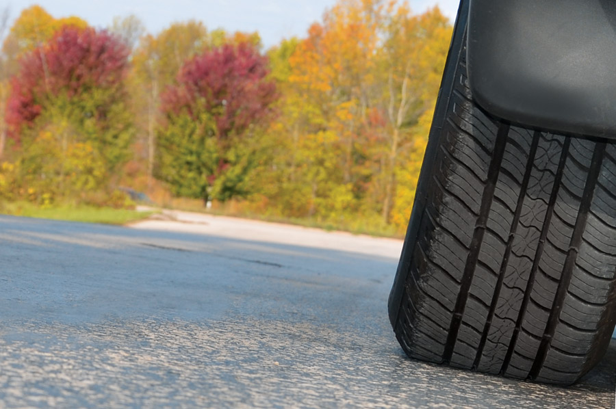

Just a few minutes each month maintaining your tires will reap big rewards in longer tire life, safer driving, better performance and higher gas mileage.

## Inflation

The most important part of tire maintenance is proper inflation. Most drivers don’t correctly check tire pressure often enough. Here’s a guide:

- Purchase your own tire pressure gauge to ensure accuracy.
- Always check pressure when the tires are cold.
- Check all tires—including the spare—at least once a month, after a large change in air temperature, and before and after a trip.
- Always replace the valve caps to keep out dirt. Replace any missing caps as soon as possible.

Manufacturers list recommended tire pressure in the owner's manual, on the end of the driver's door or in the glove compartment. This is the number you should use for proper inflation, rather then the number molded on the sidewall of a tire. However you shouldn’t exceed the maximum inflation pressure listed on the sidewall. Differences between front and rear pressure should also be observed.

Did you know that **under inflation is the #1 cause of tire failure?** And a tire can be under inflated by almost 50% before it appears low. In addition to failure, under inflated tires lead to decreased gas mileage.

## Rotation

Rotating your tires will help prevent irregular and premature tread wear and prolong tread life. Rotate tires according to the vehicle manufacturer's recommendation or at every 5,000 - 7,000 miles if you are unsure. If you have trouble remembering, you might try rotating them with **every other** oil change.

## Balancing

If your tires are unbalanced, you'll probably notice an annoying **vibration**. Unbalanced tires can lead to early and irregular tire wear and possible damage to your suspension. Tires should be professionally balanced when they are mounted on the wheels for the first time, when they are remounted (after repair) or when you notice a vibration.

**Maintain your tires now and they will treat you better down the road! And remember, if you have questions about your tires, don’t hesitate to call the pros at Matthews Tire.**
