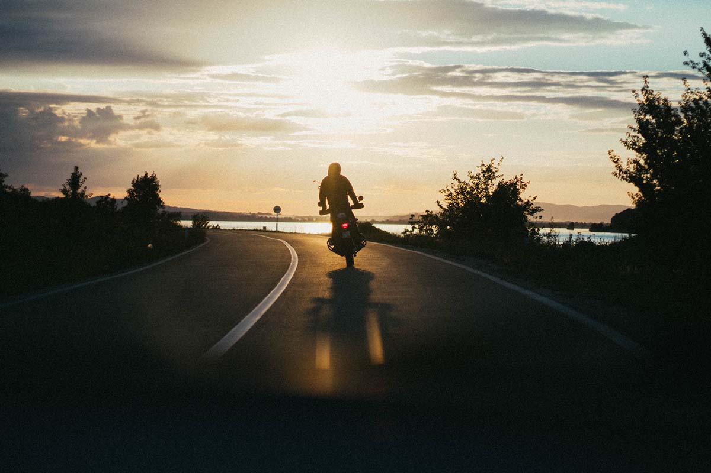

Summer is just around the corner! School will be out, temperatures will rise and more bike, pedestrian and motorcycle traffic will hit the roads and crosswalks. Whether you’re an avid cyclist, runner or driver, it’s important that everyone knows the rules and best practices to share the road together.

**Bike Safety**

According to the National Highway Traffic Safety Administration (NHTSA), there were 818 bicyclists killed in 2015—a 12% increase from 2014—and an estimated 45,000 injured in traffic crashes in the U.S. No matter if you’re a cycling enthusiast or driver, brake for a moment to learn more about how to share the road with bicycles.

- Depending on time of day and weather, bikes can be hard to spot and require drivers’ full attention. Your distracted driving (fiddling with a device, radio, eating, etc.) could cost a cyclist their life.
- Obey the speed limit! Getting to work, school or an appointment won’t matter if you strike a cyclist on the way.
- Give cyclists plenty of space on the road, maintaining at least three feet of clearance when passing them.
- Be especially alert around schools, parks and residential neighborhoods where there may be a lot of kids on bikes.

**_For cyclists:_** Stick to sidewalks, bike lanes and crosswalks, and ride the same direction as traffic when on the road. Sport reflective gear and always wear a properly fitted helmet!

**Motorcycle Safety**

The NHTSA reports motorcyclists accounted for nearly 14% of all traffic fatalities in 2015, while motorcycles make up just 3% of all registered vehicles in the U.S. Get up to speed on safety tips to share the road with motorcycles.

- When you spot a motorcyclist weaving, they aren’t showing off. They are trying to be seen!
- Adjust your mirrors and use them! More than 40% of a vehicle's perimeter has blind spots due to improper mirror placement and failure to check sideview mirrors.
- Many intersection collisions are the result of obstructed views and speed. Don’t go until you have a clear view (motorcycles can be difficult to spot!) and proceed slowly with caution.
- Though it may not look like a motorcycle needs an entire lane, give them the room to maneuver. Motorcyclists require full lane width to drive safely.
- When following a motorcycle, allow 3-4 seconds distance for swerves and emergency stops. Potholes, gravel, pavement seams and railroad crossings can be harder for motorcycles to navigate.

**_For motorcyclists:_** Always drive with a DOT-compliant helmet, reflective gear and current motorcycle license. Also, never drive while impaired!

**Pedestrian Safety**

Per the NHTSA, there were 5,987 pedestrians killed in 2016 traffic crashes in the U.S. equating to a death every 1.5 hours (a 9% increase from the previous year). Here are some important tips to share the road with those traveling on foot.

- Drive sober! Per the NHTSA, 13% of all fatal pedestrian crashes involved a driver with a BAC of .08 g/dL or higher.
- Watch for pedestrians everywhere—not just intersections. Surprisingly, 72% of pedestrian fatalities happen outside of intersections.
- Parking lots are heavy with pedestrian traffic. Drive extra slow, and stay alert throughout the entire lot.
- Give pedestrians equal share of the road, and always yield to a pedestrian in view.

**_For pedestrians:_** Always use designated crosswalks and corners for crossing streets. Also, walk—don’t run—across crosswalks. It’s harder to spot a fast-moving pedestrian.

For even more summer road safety tips, visit <a href="https://www.nhtsa.gov/" rel="nofollow" target="\_blank">nhtsa.gov</a>. With more awareness and understanding of everyone out and about—whether biking, driving, running or skateboarding—we can all share the road and enjoy plenty of summer fun!
