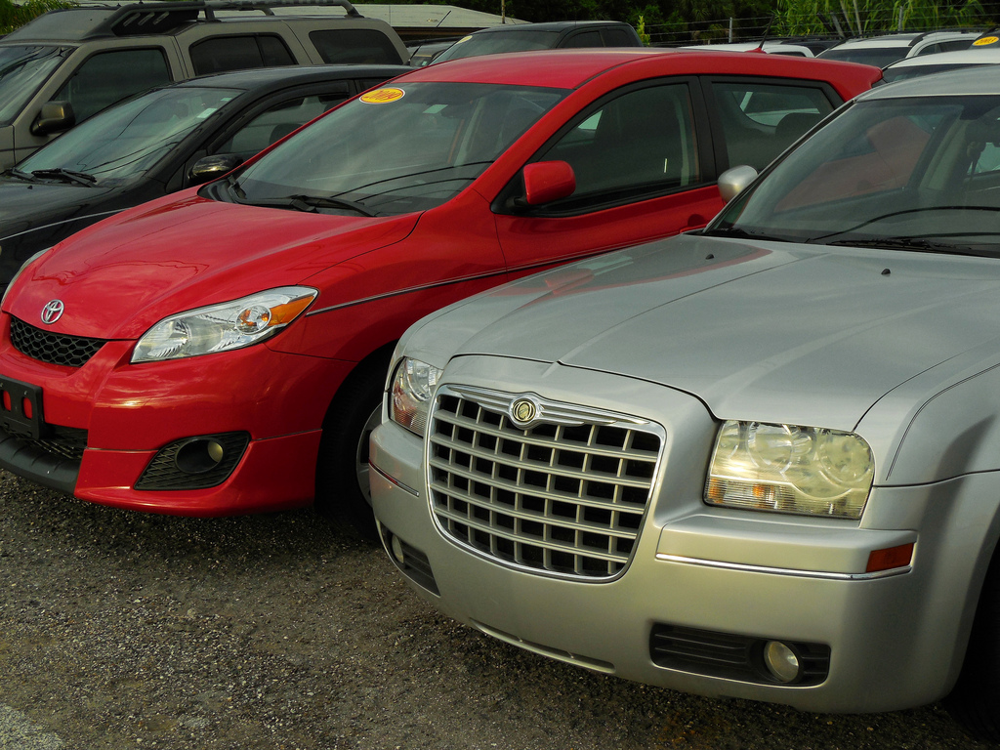

Making a wise decision about buying a used vehicle often comes down to educating yourself. According to Popular Mechanics, the following is a helpful <a href = "https://www.popularmechanics.com/cars/how-to/a5861/used-car-online-buying-guide/" target= "\_blank"> used car inspection checklist</a> to reference when evaluating a used vehicle for purchase:

- **Damage.** Is the bodywork straight? Sight down the fenders and doors for ripples. Look in the doorframes, under the hood and in the trunk for evidence of crash damage.
- **Paint.** Dull paint can usually be buffed out, but peeling paint will have to be sanded down, maybe to bare metal, and then resprayed. Not a deal-breaker, but roll it into the price.
- **Mileage.** A well-maintained car can often go 150,000 or 200,000 miles, so don't be afraid of a high-mileage car if everything else is fine. On the other hand, mileage significantly lower or higher than the national average of 14,000 per year is a red flag. Low mileage may mean a car that was rarely driven. And that's not good—sludge and carbon may have affected the engine. Or the odometer may have rolled over one more time than the seller is letting on. Check that the driver's seat and pedals reflect the mileage on the odometer. A worn brake-pedal rubber cover means lots of aggressive city miles. A brand-new brake pedal may mean the seller has replaced it to cover up the worn older one.
- **Engine.** Obviously, you need a vehicle that starts readily, runs cleanly and doesn't leak. If the seller has maintenance records, peruse them carefully. A steady progression of oil-change appointments is a great sign.
- **Tires.** Worn-out tires are an easy fix, just figure it into the offering price. But check the tire-tread wear for signs of misalignment. A front end that's out of line may mean that the suspension is worn out.
- **Suspension and shocks.** Add the cost of a set of good shocks if the ones on the car are worn out—but be prepared for additional suspension work necessitated by a lot of mileage with the shocks worn out.
- **Check for water damage.** Check for mud in the trunk or under the seats. If the owner's manual is papier-mâché or the interior smells moldy, you may have a car that's been underwater. **Never buy a flood car**—these are often reclaimed by insurance companies, rinsed off and sold at auction.

In addition to this list, Rick Roesler, manager of Matthews Tire’s Appleton East store, asks buyers to consider a few more things, “Do your research and buy from a reputable dealership. Google the vehicle to discover what type of problems people frequently report with this particular vehicle. And most important, be a smart shopper and don’t be afraid to ask questions,” he adds.

Matthews Tire Menasha store manager Craig Keberlein advises, “Be careful when a seller tries to talk you into buying an extended warranty. They tend to be overpriced and the warranty companies try very hard to get out of paying for a lot of things. Personally I think they are a waste of money unless you have a major problem, such as an engine or transmission failure, and even then it may be difficult to get the replacement costs covered.”

And what’s the smartest tip of all? According to Tom Winninghoff, manager of Matthews Tire in Green Bay, “Come to Matthews Tire to get a pre-purchase inspection!”

“If the seller won’t let you get a pre-purchase inspection, walk away. They very well may be hiding something,” adds Mike Marshall, Matthews Tire store manager in Waupaca.
