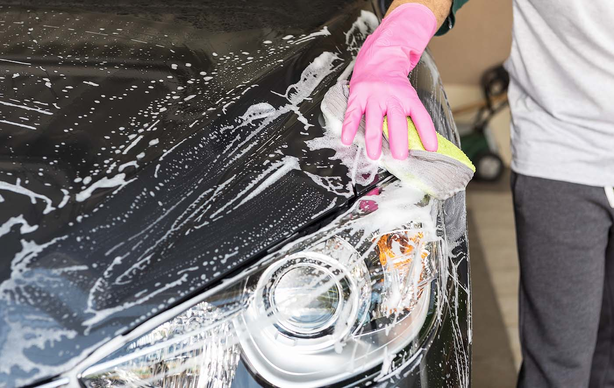
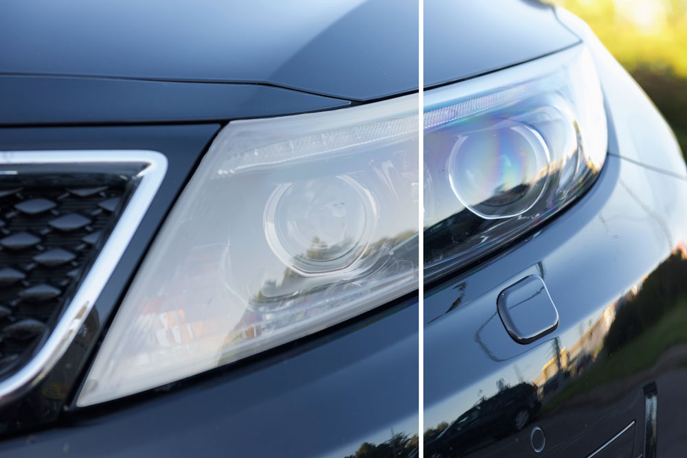

If spring puts you in a cleaning mood, direct some of that motivation toward your vehicle too! It’s always a good idea to clean the back seat, throw out any garbage, organize the glove box and vacuum the interior and floor mats. But if you’re really looking to accelerate the cleanliness of your vehicle, there’s more you can do with help from a professional. Coast into the nearest Matthews Tire at your convenience and check some of these “to dos” off your car cleaning list …

### Headlight Restoration

Unless you recently had a burnt-out headlight, you probably haven’t deconstructed and cleaned your headlight lately. You may not realize it but keeping your headlights clean is just as important as keeping your windshield clean! Cloudy, poorly maintained headlights—covered in salt, dirt, bugs, chemicals, etc.—can be dangerous. Headlight restoration will not only improve visibility while driving, but the appearance of your car overall.

### Engine Air Filter Replacement

When filters get clogged, other components of your vehicle are forced to work harder and less efficiently. Particles from old, dirty air filters can reach your vehicle’s in-take system, and overtime wear away parts of the engine such as cylinders and engine bearings. Replacing your engine air filter every 15,000 miles can improve air flow to your vehicle’s engine resulting in better engine performance and gas mileage.

### Cabin Air Filter Replacement

The cabin air filter, found on most models built after 2000, filters contaminants from the air circulating to your vehicle’s interior. An old and dirty cabin air filter not only can obstruct new air from entering your vehicle, but can also hinder the effectiveness of your defrost, heating and air conditioning systems. To ensure proper ventilation and good air quality, free of dirt, allergens, dust and more, have your air filter checked and replaced on a regular basis.

<a href="https://matthewstire.com/locations/">Call your neighborhood Matthews Tire</a> to ask about these services and other preventative maintenance to keep you rolling—and feeling so fresh and so clean—this spring!
