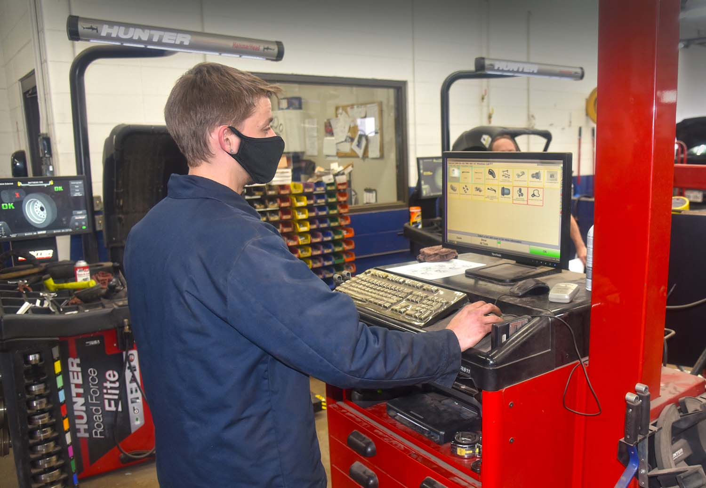

As the spring thaw melts winter away, all kinds of new things are exposed … including bothersome potholes on the roadways! Potholes can be a major concern for motorists—not only because they can disrupt smooth leisurely drives. “Potholes can be problematic in a number of ways,” said Matthews Tire Appleton West Manager Dave Flunker. “Depending on the depth of the pothole and the speed you’re traveling, you could damage your rims, pop a tire or—a lesser-known concern—throw off your alignment,” he shared.

Straight wheel alignment is important for ensuring the safety and performance of your vehicle. With proper alignment, not only does your vehicle drive straight down the road, it reduces the wear on your tires, and ultimately, ensures stronger grip on the road, more control and better fuel economy.

“There’s a misconception that wheel alignment is only addressed if you have a problem,” Dave explained. “The reality is, you should have your vehicle’s alignment checked and corrected regularly.” Dave recommends getting on a schedule to check it every spring or every time you get tires replaced. With every tire installation at Matthews Tire, our ASE-Certified technicians will also check the alignment for free. “It’s all part of the Matthews Tire difference,” he exclaimed. “We employ state-of-the-art equipment featuring a laser beam that measures angles from both the front and rear to accurately ensure everything is in line.”

Outside of preventative maintenance, there’s an increased likelihood you may need an urgent alignment check in springtime. If you hit a pothole at a high speed, wait until you can safely pull over to assess the damage. “First of all, if you have a flat tire, pull over immediately and get help,” Dave said. “Otherwise, inspect your vehicle later to see if your steering wheel is crooked or pulling to one side, a top sign that you need to correct the alignment.” Crooked alignment can have long-term effects on your vehicle including premature wear and tear on tires, poor fuel economy and difficulty steering.

If you think you’ve done serious damage after hitting a pothole and you’re not sure what to do, rely on the experts at Matthews Tire. “Stop into your nearest Matthews Tire, and we can tell you whether it’s OK to drive on it or if we need to take a closer look,” Dave assures.

Is your vehicle due for an alignment check? Experience the Matthews Tire difference at any of our convenient <a href="https://www.matthewstire.com/locations/">six locations</a>.
