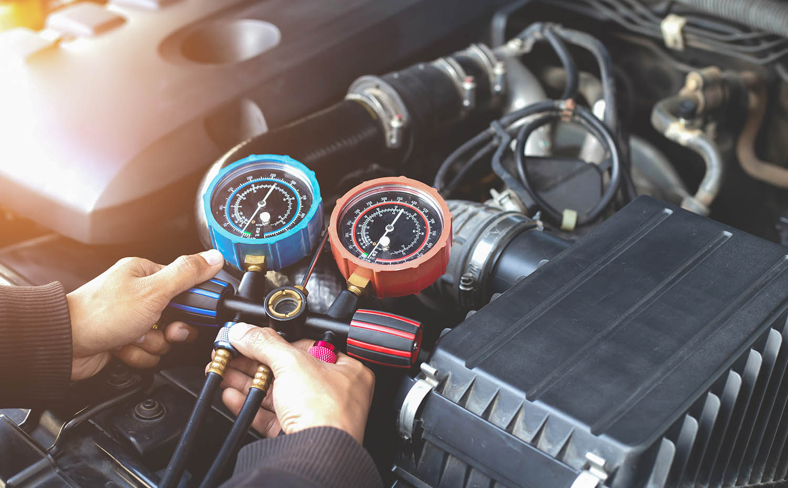

Without the right preparation, the summer heat can put a lot of stress on your car. Amidst road trips, weekend getaways and outdoor excursions, car troubles are the last thing you need this summer. Take the proper car maintenance steps now to ensure your vehicle performs well in the heat and stays in optimal condition year-round.

Not quite sure which car maintenance services you need? Matthews Tire manager and auto expert Craig Keberlein is here to help. Read on to learn Craig’s top summer car maintenance tips to prepare your automobile for the heat.

## Table of Contents

<ul>
<li><a href="#importance-of-summer-car-maintenance">Importance of Summer Car Maintenance</a></li>
<li>
  <a href="#how-does-the-summer-heat-affect-your-car">How Does the Summer Heat Affect Your Car?</a>
  <ul>
    <li><a href="#common-effects-of-summer-heat-on-your-car">Common effects of summer heat on your car.</a></li>
  </ul>
</li>
<li>
  <a href="#craigs-summer-car-maintenance-tips">Craig’s Summer Car Maintenance Tips</a>
  <ul>
    <li><a href="#1-test-your-brakes">1. Test your brakes.</a></li>
    <li><a href="#2-check-tire-pressure-regularly">2. Check tire pressure regularly.</a></li>
    <li><a href="#3-get-a-tire-rotation">3. Get a tire rotation.</a></li>
    <li><a href="#4-inspect-the-ac">4. Inspect the AC.</a></li>
    <li><a href="#5-get-a-full-service-oil-change">5. Get a full-service oil change.</a></li>
  </ul>
</li>
<li><a href="#matthews-tire-summer-car-maintenance-services">Matthews Tire Summer Car Maintenance Services</a></li>
</ul>

## Importance of Summer Car Maintenance

Why is it so crucial to maintain your car over the summer? According to Craig, “maintaining your car is necessary year-round if you want it running at the top of its performance.” Summer is an especially important time to inspect your car and make necessary repairs because the heat can put extra stress on your vehicle.

Of course, there’s no way you can predict or prepare for every car trouble you’ll have over the summer. To discover which summer car maintenance services your vehicle needs, Craig shares his advice.

“Most of the issues we see with cars brought into Matthews Tire over the summer have to do with overheating,” Craig stated. He went on to say that “you can set yourself up for success by preparing your car to operate in the summer heat.”

## How Does the Summer Heat Affect Your Car?

Cars are built to withstand harsh weather conditions. That doesn’t mean your vehicle is completely immune to high temperatures, however. Driving in hot summer temperatures puts stress on your engine and other parts of your vehicle.

### Common effects of summer heat on your car.

- **Oil thinning** - The oil in your car will thin slightly when it heats up, meaning your engine may not be getting the full protective benefits of the oil.
- **Tire wear** - Tires will deteriorate and require replacements faster when the air inside of them gets hotter.
- **Engine damage** - The cooling system in your car must work overtime during the summer. If not properly maintained, your internal car parts may deteriorate and your engine can overheat and become extremely damaged.

Now that you know the importance of keeping your car well-maintained this summer, it’s time to learn how.

## Craig’s Summer Car Maintenance Tips

Craig has shared and broken down his top summer car maintenance tips to keep you rolling this summer and beyond. Here are his biggest tips to keep your car in the best shape through these hot summer months:

### 1. Test your brakes.

As Wisconsinites, most of our cars take quite a beating over the winter. According to Craig, “ice, salt and debris buildup on your undercarriage can cause damage to internal car parts.” Brake pads and rotors can break down quickly if this occurs.

Before you head out on any long-distance trips this summer, test that your brakes are in proper working order. You can do this by taking your car out on a drive, preferably on both city roads and the highway, and paying close attention to your brakes. Ensure your brake lights are working, listen for any strange noises, and check the responsiveness when you brake.

**Craig’s pro tip:** In addition to winter buildup, Craig added that “hot air can also put stress on your brakes,” and cause them to perform poorly. Adding brake inspections to your summer car maintenance will help you notice brake issues immediately and keep you safe on the road.

### 2. Check tire pressure regularly.

As we mentioned above, your tires can deteriorate faster than usual if the air inside of them gets too hot. “Maintaining the proper tire pressure will keep the air in your tires cooler,” Craig stated.

Tire pressure tends to fluctuate less during the warmer summer months, but Wisconsin weather can be unpredictable. It is common for the air pressure inside your tires to fluctuate. Check your car’s tire pressure regularly this summer, especially before hauling anything or going on a road trip.

**Craig’s pro tip:** Do you know where to find the ideal tire pressure for your car? It’s actually not on your tires like many people believe. “Check the sticker on the inside of your driver’s door to locate the recommended tire pressure for your car,” Craig instructs.

### 3. Get a tire rotation.

Tire rotations are recommended for every 5,000 miles you drive. This service repositions your tires and prevents uneven wear on your tires.

“If you want to get the most value out of your tires,” Craig recommends you “add a tire rotation to your summer car maintenance schedule.”

**Craig’s pro tip:** Never pay for a tire rotation again! Get FREE tire rotations for life when you purchase a full set of four tires from any of the Matthews Tire locations throughout Northeast Wisconsin.

### 4. Inspect the AC.

Have you noticed it’s a little hotter in your car than usual? It’s a good idea to check that your car’s air conditioning is working properly. While it isn’t necessarily a vital auto mechanism, a broken air conditioning system may be a symptom of more serious problems.

“If your car is blowing hot air with the AC on, it could be a sign that something’s wrong with the cooling system,” Craig said. If this is the case, your car can easily overheat, causing catastrophic damage to the engine.

**Craig’s pro tip:** Stop into Matthews Tire if you think there might be a problem with your car’s AC or cooling system. Our expert, ASE-certified technicians can help you determine the issue and make any necessary auto repairs.

### 5. Get a full-service oil change.

Motor oil breaks down over time and thins when it overheats, making it much less effective at providing lubrication to the motor and engine. Therefore, regular oil changes are a vital service to add to your summer car maintenance checklist.

Craig, along with additional Matthews Tire auto experts, recommends getting an oil change every 3,000 miles to keep your car in the best condition.

**Craig’s pro tip:** Want to get the best value out of your oil change? Invest in full synthetic oil, which provides better engine performance and allows for longer intervals between oil changes.

## Matthews Tire Summer Car Maintenance Services

No matter what summer car maintenance needs you have this season, Matthews Tire is here to help! [Schedule your appointment](/locations/) at one of our convenient locations in Appleton, Menasha, Waupaca, Fond du Lac or Green Bay today.
