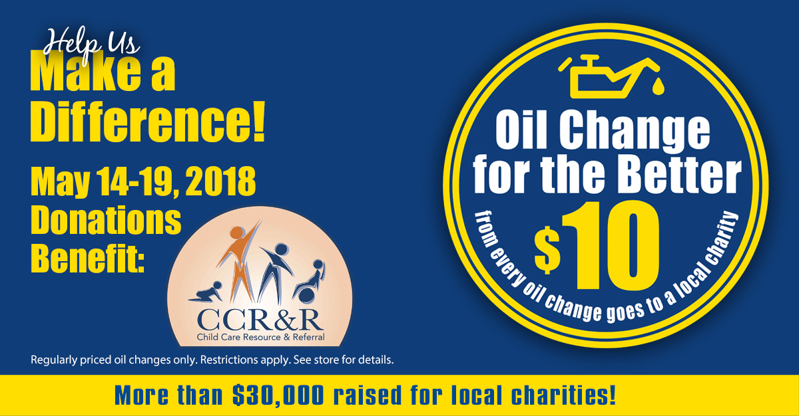

We're hosting our 12th Oil Change for the Better event **May 14-19, 2018**. For every regularly priced oil change performed throughout the week at all six locations (in Appleton–East and West, Green Bay, Menasha, Fond du Lac and Waupaca), we'll donate $10 to <a target="_blank" href="https://ccrrfoxvalley.org/en/">Child Care Resource and Referral</a> of the Fox Cities, a non-profit organization that has served northeast Wisconsin for over 30 years. Child Care Resource and Referral provides families, child care providers, employers and the community with services that improve the quality and accessibility of early childhood education and care.

"We are so excited for the opportunity to work with Matthews Tire to bring awareness to the importance of early childhood education and quality care, as well as raise funds that will subsidize training for child care providers in our local communities," said Child Care Resource and Referral Executive Director Judith Olson. Olson shared that the money raised through Oil Change for the Better will be used for their scholarship program to support ongoing training for early childhood teachers.

"We learned that many child care staff don’t make the wages to support continuing education," shared Matthews Tire President Trevor Rezner. "We're happy to support a scholarship program that not only benefits teachers in our area, but ultimately, helps provide children in our communities with the care and education they deserve."

Oil Change for the Better is a semi-annual, weeklong charity event held by Matthews Tire. This May will be the 12th Oil Change for the Better event. In the last six years, Matthews Tire has raised $30,185 for various local non-profits including Fox Valley Humane Society, Make-A-Wish Foundation, Salvation Army, Disabled American Veterans Transportation Program, Catalpa Health’s _Race for a Reason_, Big Brothers Big Sisters, Old Glory Honor Flight, Saving Paws Animal Rescue, Walleyes for Kids and Leukemia and Lymphoma Society.

<a href="https://matthewstire.com/locations/">Schedule your Oil Change for the Better now!</a>
