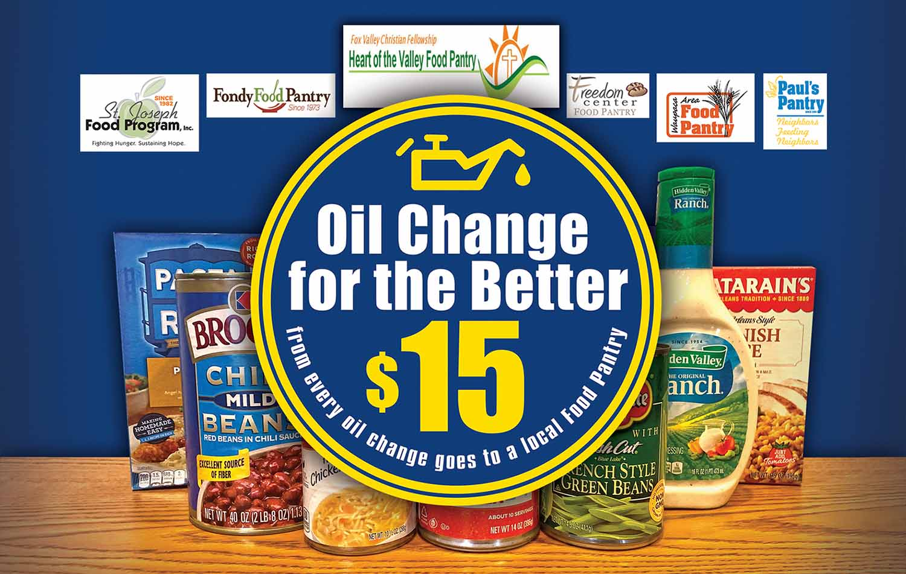

We’re hosting our 16th _**Oil Change for the Better**_ event Nov. 16-21, 2020! For every regular-priced oil change performed throughout the week at all six locations (in Appleton–East and West, Menasha, Waupaca, Fond du Lac and Green Bay), Matthews Tire will donate $15 to a local food pantry. Benefitting food pantries include Fondy Food Pantry, Freedom Center Food Pantry, Heart of the Valley Food Pantry, Paul’s Pantry in Green Bay, St. Joseph’s Food Program in Menasha and Waupaca Food Pantry. There will also be collection baskets for non-perishable food donations set up in each lobby throughout the week.

“According to Feeding America, over 500,000 people in Wisconsin struggle with hunger,” Matthews Tire President Trevor Rezner shared. “That’s why, for this event, we increased our donation from $10 to $15 per oil change, plus added food collection baskets at all locations. We want to do all we can to provide food security to those who need it most right before the holidays.”

_**Oil Change for the Better**_ is a semi-annual weeklong charity event held by Matthews Tire. This November will be the sixteenth _**Oil Change for the Better**_ event. In the last eight years, Matthews Tire has raised over $50,000 for various local nonprofits including Fox Valley Humane Society, Make-A-Wish Foundation, Salvation Army, Disabled American Veterans Transportation Program, Catalpa Health’s _Race for a Reason_, Big Brothers Big Sisters, Old Glory Honor Flight, Saving Paws Animal Rescue, Walleyes for Kids, Leukemia and Lymphoma Society, Child Care Resource & Referral, SOAR Fox Cities, WisconSibs and Breast Cancer Family Foundation.

[Schedule your Oil Change for the Better now!](/locations/)
