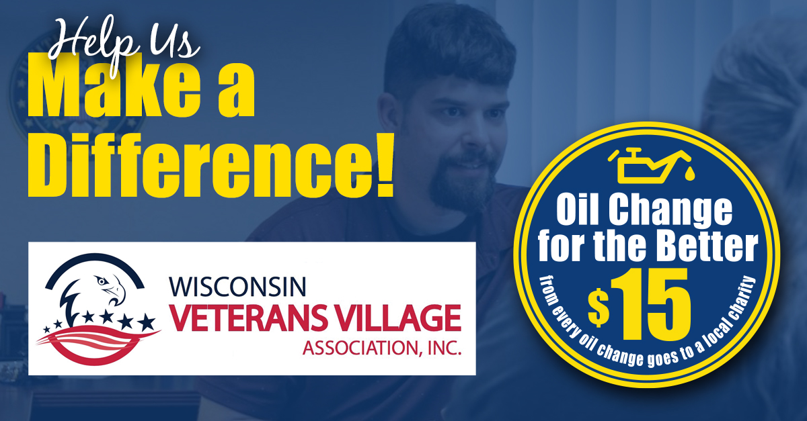

Matthews Tire is hosting **_Oil Change for the Better_** event **_May 24-28, 2021_**. For every regular-priced oil change performed throughout the week at all six locations (in Appleton–East and West, Menasha, Waupaca, Fond du Lac and Green Bay), Matthews Tire will donate **_$15_** to the Wisconsin Veterans Village Association. The Wisconsin Veterans Village is a local non-profit that provides safe and affordable housing, support and community to veterans throughout their entire lifespan.

“We are enthusiastic about elevating the community of support for the veterans that call the Wisconsin Veterans Village home,” stated Dr. Tom Wiltzius, founding member and capital campaign co-chair for the Wisconsin Veterans Village.

Money raised through **_Oil Change for the Better_** will support the Goodwill Industries of North Central Wisconsin (NCW) Career & Community Center located within the Veterans Village. This partnership helps eliminate barriers to employment for veterans and veteran residents through job training, addressing financial literacy, promoting access to community services and support.

“Veterans are able to achieve positive changes through access to Goodwill’s services at the Wisconsin Veterans Village,” Wiltzius shared. “Further, these changes are never limited to the veterans who reside in our apartments. Positive change can and does occur in the lives of their spouses, daughters, sons, grandchildren, siblings, mothers, fathers, and close friends.”

**_Oil Change for the Better_** is a semi-annual weeklong charity event held by Matthews Tire. This May will be the 17th **_Oil Change for the Better_** event. In the last nine years, Matthews Tire has raised over $57,000 for various local nonprofits including Fox Valley Humane Society, Make-A-Wish Foundation, Salvation Army, Disabled American Veterans Transportation Program, Catalpa Health’s _Race for a Reason_, Big Brothers Big Sisters, Old Glory Honor Flight, Saving Paws Animal Rescue, Walleyes for Kids, Leukemia and Lymphoma Society, Child Care Resource & Referral, SOAR Fox Cities, WisconSibs, Breast Cancer Family Foundation and a variety of local food pantries.

[Schedule your Oil Change for the Better now!](http://www.matthewstire.com/locations/)
