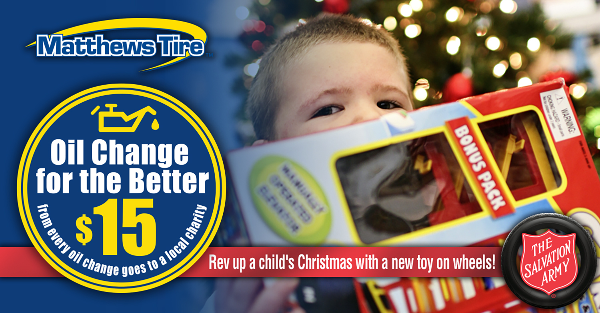

We’re hosting our 18th **_Oil Change for the Better_** event **Dec. 6-11, 2021**. For every regular-priced oil change performed throughout the week at all six locations (in Appleton–East and West, Menasha, Waupaca, Fond du Lac and Green Bay), Matthews Tire will donate **$15** to their local branch of The Salvation Army. There will also be collection bins for “toys with wheels” in the lobby of each location throughout the week.

“Between price increases and the lasting effects of the pandemic, we know our community needs us now more than ever … especially as we approach the holidays,” shared Trevor Rezner, president of Matthews Tire. “That’s why we’re doubling up on our donation this year. We’re raising money and hoping to collect a lot of cool toys for kids in need this Christmas.”

Collectively, The Salvation Army in Fond du Lac, Waupaca, Fox Cities and Green Bay provided Christmas gifts for almost 6,000 Northeast Wisconsin families in 2020. As a result of those efforts, 15,320 kids received gifts through The Salvation Army last year. Money raised through **_Oil Change for the Better_** will provide hope and healing to those in need through The Salvation Army’s programs and services that include food, rent and utility assistance.

**The Salvation Army** annually helps nearly 23 million Americans overcome poverty, addiction and economic hardships through a range of social services. By providing food for the hungry, emergency relief for disaster survivors, rehabilitation for those suffering from drug and alcohol abuse, and clothing and shelter for people in need, The Salvation Army is doing the most good at 7,600 centers of operation around the country. In the first-ever listing of “America’s Favorite Charities” by _The Chronicle of Philanthropy_, The Salvation Army ranked as the country’s largest privately funded, direct-service nonprofit. For more information, visit <a href="https://www.salvationarmyusa.org/usn/" target="_blank" rel="noopener noreffer">SalvationArmyUSA.org</a>. Follow us on Twitter <a href="https://twitter.com/SalvationArmyUS?ref_src=twsrc%5Egoogle%7Ctwcamp%5Eserp%7Ctwgr%5Eauthor" target="_blank" rel="noopener noreferrer">@SalvationArmyUS</a> and <a href="https://twitter.com/hashtag/DoingTheMostGood?src=hashtag_click" target="_blank" rel="noopener noreferrer">#DoingTheMostGood</a>.

**_Oil Change for the Better_** is a semi-annual weeklong charity event held by Matthews Tire. This December will be the 18th **_Oil Change for the Better_** event. Since 2012, Matthews Tire has raised over $57,000 for various local nonprofits including Fox Valley Humane Society, Make-A-Wish Foundation, Salvation Army, Disabled American Veterans Transportation Program, Catalpa Health’s _Race for a Reason_, Big Brothers Big Sisters, Old Glory Honor Flight, Saving Paws Animal Rescue, Walleyes for Kids, Leukemia and Lymphoma Society, Child Care Resource & Referral, SOAR Fox Cities, WisconSibs, Breast Cancer Family Foundation, a variety of local food pantries and Wisconsin Veterans Village Association.

<a href="https://matthewstire.com/locations" class="btn btn-primary btn-small">Schedule your Oil Change for the Better now!</a>
