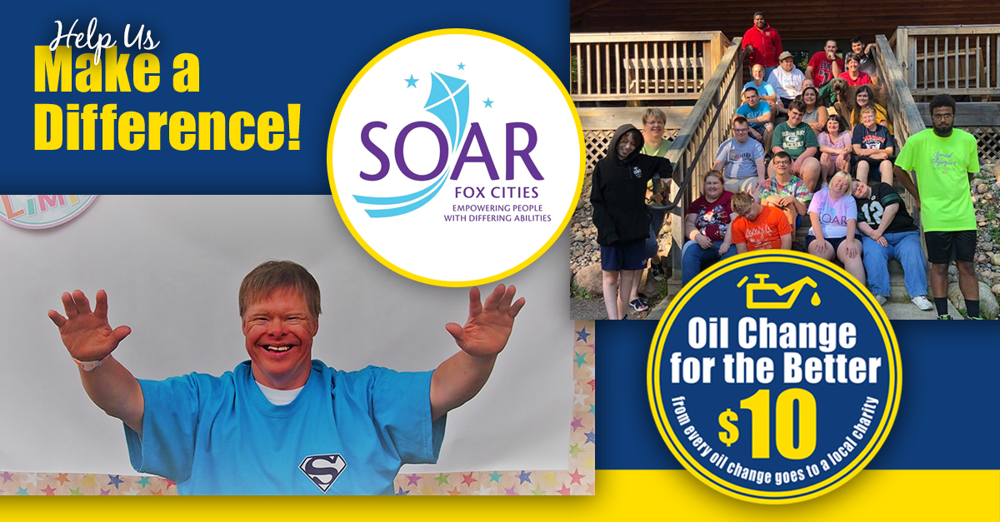

We’re hosting our 13th **_Oil Change for the Better_** event **October 22-27, 2018!** For every regular priced oil change performed throughout the week at all six locations (in Appleton–East and West, Menasha, Waupaca, Fond du Lac and Green Bay), Matthews Tire will donate **$10** to <a href="https://www.soarfoxcities.com/" target="\_blank">SOAR Fox Cities</a>. With a mission to empower people with differing abilities, SOAR Fox Cities serves more than 1,200 participants and touches the lives of over 19,000 family and community members in Northeast Wisconsin.

“We are beyond excited to partner with Matthews Tire to empower individuals with differing abilities,” shared Executive Director Erin N. Schultz, MSW. “At SOAR Fox Cities, we envision a world where all individuals are seen for their ABILITY, not their disABILITY. We’re a small nonprofit located just a few blocks from downtown Appleton and within the walls of our offices, and throughout the community, we aim to do just what our name says: SOAR! We help kiddos and adults SOAR above the barriers their disability may create.”

Money raised through **_Oil Change for the Better_** will be used to help kids like Dan. Dan was born with Down syndrome and is wheelchair bound. He often struggles with verbal communication, which can make it hard to make friends or fit in. But Dan has a place where he is known for his ability not his disability—SOAR Fox Cities. Through programs like Camp and Special Olympics, Dan can SOAR higher!

“We are proud to support an organization that makes a huge impact right here in our own backyard,” shared Matthews Tire President Trevor Rezner. “It’s a wonderful feeling to know dollars raised through something as simple as an oil change can make such a difference to so many families in our community.”

**_Oil Change for the Better_** is a semi-annual, weeklong charity event held by Matthews Tire. This September will be the thirteenth **_Oil Change for the Better_** event. In the last six years, Matthews Tire has raised $35,435 for various local nonprofits including Fox Valley Humane Society, Make-A-Wish Foundation, Salvation Army, Disabled American Veterans Transportation Program, Catalpa Health’s Race for a Reason, Big Brothers Big Sisters, Old Glory Honor Flight, Saving Paws Animal Rescue, Walleyes for Kids, Leukemia and Lymphoma Society and Child Care Resource & Referral.

## <a href="https://matthewstire.com/locations/">Schedule your **_Oil Change for the Better_** now!</a>
