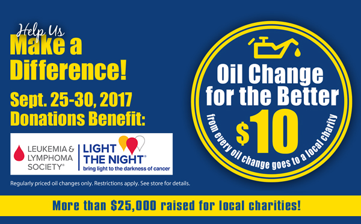

We're hosting our 11th **_Oil Change for the Better_** event **September 25-30, 2017!** For every regular priced oil change performed during the week at all six locations (Appleton–East and West, Green Bay, Menasha, Fond du Lac and Waupaca), we'll donate **$10** to the Leukemia and Lymphoma Society's **_Light The Night©_** event in Appleton October 6, 2017.

"Every three minutes someone is diagnosed with a blood cancer and every 10 minutes someone loses their battle," **_Light The Night_** Campaign Manager Megan Kreuter shared. "Our mission is to cure Leukemia, Lymphoma and Hodgkin's disease, plus improve the quality of life for patients and their families. Money raised will help local families with the financial difficulties that accompany a cancer diagnosis, will help fund support groups, and be used to further lifesaving research and new treatments."

Part of a nationwide event, Appleton's **_Light The Night_** will take place Friday, October 6th at Neuroscience Group Field at Fox Cities Stadium on Casaloma Drive. Registration will begin at 4:30pm, with a walk and fireworks show to follow. All walk participants will receive a paper lantern to carry in celebration or memoriam. Matthews Tire will have paper lanterns on display at all six locations throughout **_Oil Change for the Better_** in anticipation of the event.

"September is blood cancer awareness month so we thought this would be a great time to bring light to such a worthy cause and special Appleton event," shared Matthews Tire President Trevor Rezner. "This cause is particularly special to the Matthews Tire family as our long-time associate and friend Kristy Christensen will be recognized as this year's honorary hero." Christensen, a lymphoma survivor, serves on the LLS Wisconsin Chapter executive committee and will be giving a keynote speech at this year’s **_Light The Night_** walk.

**_Oil Change for the Better_** is a semi-annual, weeklong charity event held by Matthews Tire. In the last five years, Matthews Tire has raised over $25,225 for various local non-profits including Fox Valley Humane Society, Make-A-Wish Foundation, Salvation Army, Disabled American Veterans Transportation Program, Catalpa Health's Race for a Reason, Big Brothers Big Sisters, Old Glory Honor Flight, Saving Paws Animal Rescue and Walleyes for Kids.

[Schedule your Oil Change for the Better now! ](https://matthewstire.com/locations/)
