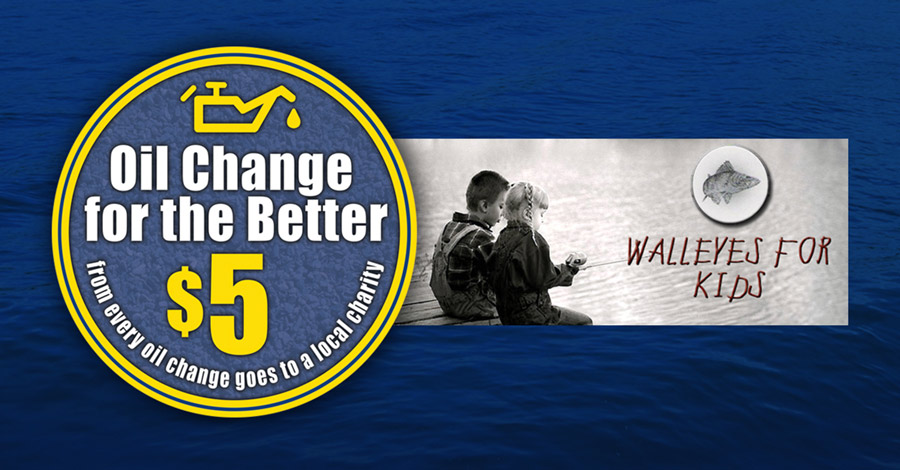

We're hosting our 10th _Oil Change for the Better_ event May 15-20 at all six Matthews Tire locations! For every regular price oil change performed throughout the week, we'll donate $5 to Walleyes for Kids.

"Matthews Tire is proud to support this valuable organization with _Oil Change for the Better_," shared Matthews Tire General Manager Trevor Rezner. "Their organization embodies things we value—hard work, appreciation for the outdoors, sportsmanship and help for those who need it most."

Walleyes for Kids is a local non-profit dedicated to providing enjoyable, character-building opportunities to children in need. What began as an annual fish fry has evolved into much more. Members raise funds to introduce kids to organized sports and have also assisted in funding activities such as equine therapy for abused children. In addition, Walleyes for Kids supplies fishing rod/reel combos for handing out to children lining parade routes every summer.

During the week of _Oil Change for the Better_, Matthews Tire will also hold drawings at all six locations for kid's fishing rod/reel combos donated by Walleyes for Kids. You don't need to be a parent to enter—simply fill out an entry slip with your name, contact information and a child in mind. Three names will be drawn at random from each location the following week and Matthews Tire will notify winners at that time.

_Oil Change for the Better_ is Matthews Tire's semi-annual, weeklong charity event. In the last five years, we've raised more than $22,500 for various local charities including Fox Valley Humane Society, Make-A-Wish Foundation, Salvation Army, Disabled American Veterans Transportation Program, Catalpa Health’s Race for a Reason, Big Brothers Big Sisters, Old Glory Honor Flight and Saving Paws Animal Rescue.

Help kids discover sports with Walleyes for Kids! [Schedule an appointment at the Matthews Tire nearest you](http://matthewstire.com/locations/).
