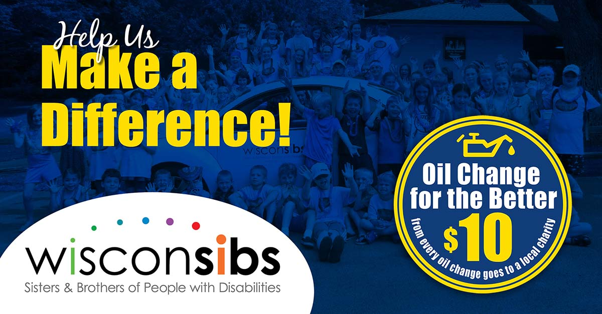

We’re hosting our 14th **_Oil Change for the Better_** event April 22-27, 2019! For every regular-priced oil change performed throughout the week at all six locations (in Appleton–East and West, Menasha, Waupaca, Fond du Lac and Green Bay), Matthews Tire will donate $10 to <a href="https://wisconsibs.org/" target="\_blank" rel="noreferrer">WisconSibs</a>, a local non-profit that provides programs and resources to siblings of kids with disabilities.

“We are excited to learn that WisconSibs will benefit from Oil Change for the Better! What a fitting name to support what WisconSibs is all about,” Executive Director Harriet Redman shared. “When a family learns that one of their children will be living with a disability, it can be devastating for not only parents, but siblings too. But with peer support, information and connections to local resources, the lives of siblings can change for the better,” she added.

Money raised through **_Oil Change for the Better_** will help fund WisconSibs popular summer camp programs and other new initiatives to support siblings of kids with disabilities. “WisconSibs is a great organization doing important work right here in northeast Wisconsin,” shared Matthews Tire President Trevor Rezner. “We’re proud to, not only support this organization, but help bring awareness to their cause as well.”

**_Oil Change for the Better_** is a semi-annual, weeklong charity event held by Matthews Tire. This April will be the 14th **_Oil Change for the Better_** event. In the last seven years, Matthews Tire has raised $40,455 for various local nonprofits including Fox Valley Humane Society, Make-A-Wish Foundation, Salvation Army, Disabled American Veterans Transportation Program, Catalpa Health’s _Race for a Reason_, Big Brothers Big Sisters, Old Glory Honor Flight, Saving Paws Animal Rescue, Walleyes for Kids, Leukemia and Lymphoma Society, Child Care Resource & Referral and SOAR Fox Cities.

<a href="/contact/">Schedule your Oil Change for the Better now!</a>
