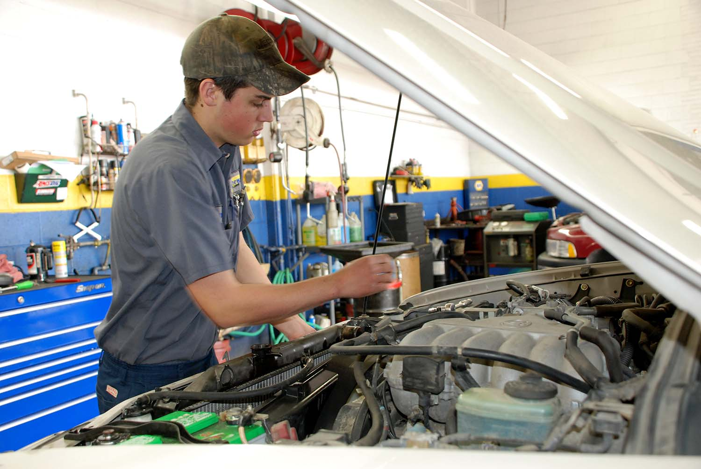

At Matthews Tire, we regularly promote our services performed by skilled, trained ASE-certified technicians. It sounds impressive, but some customers may be wondering … what exactly does that mean? Our Green Bay Store Manager Tom Winninghoff explains, “It’s the only way to truly assess the competency of automotive technicians on a national scale in various areas of service.”

The National Institute for Automotive Service Excellence offers eight in-depth exams to measure technicians on a standard scale of proficiency. The exams are categorized by service including Engine Repair, Automatic Transmission/Transaxle, Manual Drive Train & Axles, Suspension & Steering, Brakes, Electrical/Electronic Systems, Heating & Air Conditioning, Engine Performance and Light Vehicle Diesel Engines. Each test is 50 questions and “actually quite difficult—only 65% of technicians pass,” Winninghoff added.

A technician must have at least two years of on-the-job experience or one year of on-the-job experience plus a two-year degree to begin taking ASE-certification exams. They may choose to take any one of the eight at any point in time and are not obligated to take all. To maintain certification, technicians must retake exams every five years.

“Just because someone doesn’t have the exam certifications doesn’t mean they aren’t highly capable technicians.” Tom emphasized, “BUT if someone has the certification—especially the Master Automobile Technician status—they likely care a lot about the work they’re providing.” Technicians who elect to take all eight exams, and pass them, receive the highest status, Master Automobile Technician.

Because Matthews Tire highly values professional development, we staff several ASE-certified technicians, with one to three Masters at each of our seven locations. Not only do we require each employee to complete 30 hours of training per year, Matthews Tire also reimburses them for any training or testing fees. Aside from the ASE-certified training and exams, our employees have taken training courses at local tech schools to stay up to date on new technology and changing vehicle needs such as Advanced Driver-Assisted Systems, hybrid and diesel training.

Overall, professional development programs, such as ASE-certifications, are designed to give both automotive employers and their customers peace of mind knowing their technicians have valuable experience in the field, plus proficient knowledge of various levels of service. If an employer makes professional development a priority, and the technicians make the effort and time to pass the test, it proves something much more important than a certification on paper. “Simply put, it proves the organization and the employees truly care,” Winninghoff shared.
