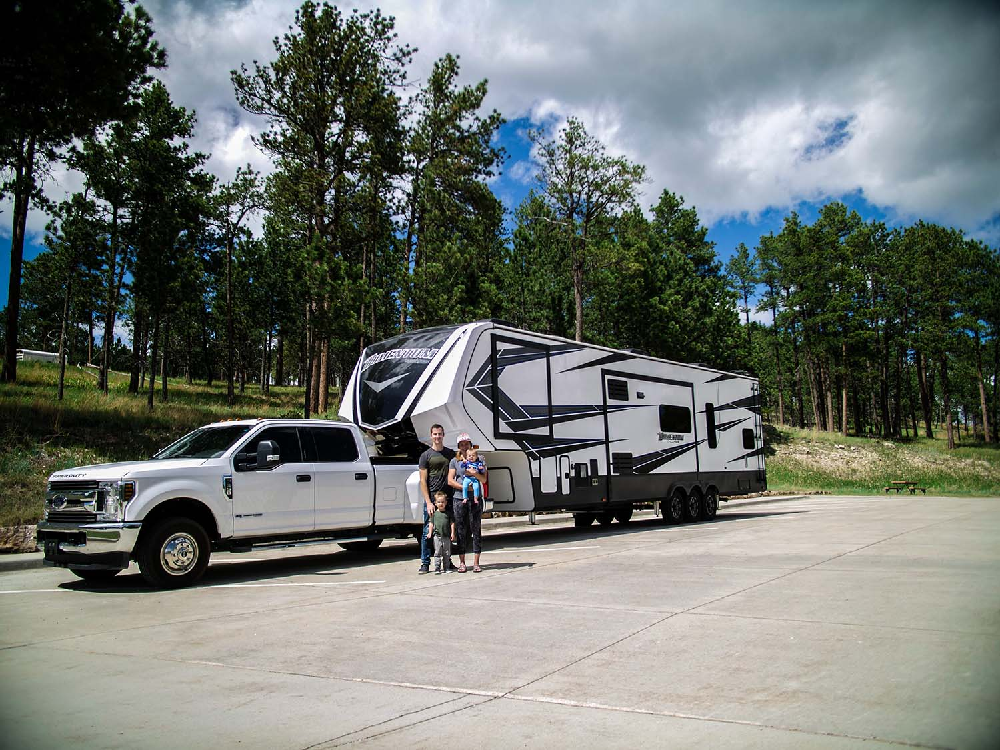

When summer hits in Wisconsin so does the traffic. Most are headed to their favorite spots “up north” and many have trailers, campers or boats in tow. If you’re thinking of hitting the road with summer toys, take note of these top five tips for towing from Matthews Tire Fond du Lac Manager Todd Steffes.

## Tip #1: Ensure your vehicle is rated for what you want to tow.

First and foremost, you must ensure the vehicle you’re driving is rated for what you’re pulling. Check the owner’s manual for the manufacturer’s recommendations. Pulling something beyond your vehicle’s recommended capacity isn’t just bad for the vehicle—it’s dangerous. Your load could incorrectly steer your vehicle, greatly extend your stopping distance or even pull you off the road.

## Tip #2: Fill your tires to the max tire pressure.

Check the age and abrasion level of your tires. Manufacturers usually stand behind tires for six years. If they’re older than six years, it’s time for a new set. Once you’ve confirmed your tires are in good shape, fill them to the maximum tire pressure. Heat wears tires, especially trailer tires! Tires generate a lot of heat running down the road. Combine that with hot weather, hot pavement and towing a heavy amount. The more air in the tire, the cooler it will run. In addition, be sure to pack a spare tire. Auto service is minimal on weekends, and having a spare tire—and the ability to change a tire—is crucial to getting you back on the road to summer fun!

## Tip #3: Inspect the wheel bearings.

It’s usually bad tires or the wheel bearings that can leave you stranded on the side of the road. Make sure to have your wheel bearings inspected annually—especially on boat trailers! Water can really harm your wheel bearings. At an annual inspection, your automotive service provider can repack the wheel bearings with new grease. We recommend inspecting utility trailers and campers every two or three years.

## Tip #4: Drive slowly and safely.

Allow plenty of time to reach your destination. The faster you go, the more dangerous it can be to pull heavy trailers. Slow down, take turns with caution, and give yourself a lot of room. The heavier the load, the more stopping distance you’ll require.

## Tip #5: Perform an all-over inspection.

Look closely at the lights, mirrors, hitch connections, and look even closer at your brakes. Many large campers or trailers have integrated brake systems. It’s vital to ensure the brake system works properly, especially if you plan to explore hilly or mountainous terrain. Make sure everything is tied down tight with all belongings secured. Plus, take note of your width and height clearance. You don’t want to chance whether you’ll fit in parking areas, under bridges or down certain lanes after you’re already on the road.

Matthews Tire does comprehensive annual vehicle, camper and trailer inspections. Contact the ASE-certified experts at your neighborhood Matthews Tire to make an appointment today!

<a href="https://matthewstire.com/locations" class="btn btn-primary btn-small">Find your nearest Matthews Tire</a>
