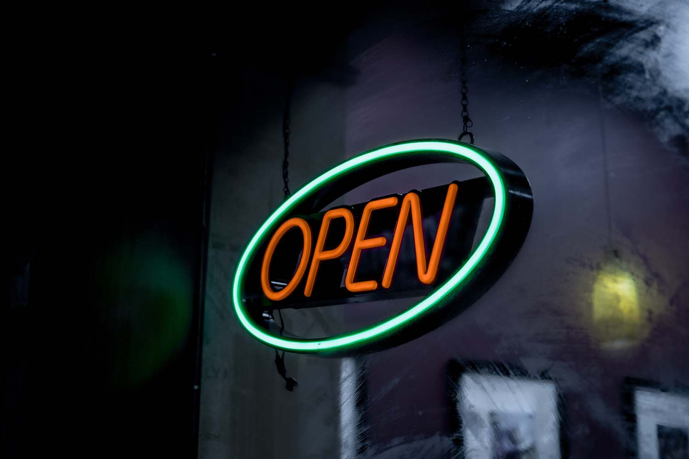

As an automotive maintenance and repair shop, Matthews Tire is considered an essential business. All of our locations are still open, serving the public–especially our essential workers who still need to get from point A to point B safely. As we continue to navigate this uncertain time, the safety of both our customers and our hardworking staff is our first priority. In order to maintain our high-quality service while protecting everyone involved, we have implemented the following precautions and procedures until further notice:

## Hours

For the time being, all of our locations are closed on Saturdays. This is only temporary, will help to conserve our resources and will reduce risk for our employees.

## Protection

Our technicians are all wearing protective gloves while servicing all vehicles and are frequently washing hands and surfaces. Depending on their role, some are wearing masks as well.

## Sanitization

After servicing your vehicle, our technicians will sanitize all areas of the interior, paying extra attention to the steering wheel, door handles, dash dials and more. Our lobbies—including doors and counter tops—are disinfected frequently.

## Social Distancing

We offer FREE vehicle drop off and pick-up service to customers. Anyone who doesn't feel comfortable entering our building can use our key dropbox. Please reach out to your preferred Matthews Tire location to verify that they can accommodate your request before arrival. And before picking up your vehicle, please call to verify it’s ready, and keys are deposited in the dropbox.

Matthews Tire is committed to safely supporting our communities with essential automotive services. If you have any questions about our precautions and procedures during COVID-19, please reach out to us at <a href="tel:920-734-5701">920-734-5701</a>. Thank you for your continued support.
