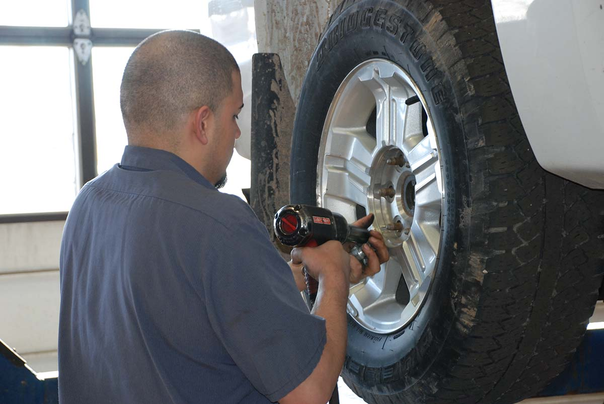

<!--  -->

The National Ocean and Atmospheric Administration recently announced that La Niña will continue throughout the winter of 2021. While the phenomenon occurs in the Pacific Ocean, it affects Northern climates, such as Wisconsin, with colder, wetter and snowier weather.

Wetter weather means slick and possibly dangerous roadways. Are you prepared? Tom Winninghoff, Matthews Tire Green Bay manager, says, “It’s important to have your tires regularly inspected, rotated and balanced by a professional. When you buy tires at Matthews, we’ll do that free of charge for the life of the tire.”

As part of your vehicle’s regular maintenance, rotating and balancing your vehicle’s tires can extend the life of the tires, Tom shared. “We recommend having a professional rotate your tires every 6,000 miles.” Turning, accelerating and braking affects each tire differently depending on their position on the vehicle, so rotating your tires ensures wear is evenly spread across all tires.

“For example, if you have front-wheel drive, all the power is coming from the front. If you don’t rotate your tires, the front ones will wear twice as fast as the back ones,” Tom explained. “We’ll also balance your tires and check the tire pressure to ensure everything is even and runs smoothly.”

While technicians inspect your tires, they use a tread depth gauge to determine how much life is left in your tire. A brand-new tire measures at 11/32”. If your vehicle’s tires get to 2/32” the vehicle is considered legally bald and should not be driven on the road. “We recommend that you have your tires replaced at 4/32,” especially in our climate,” Tom shared.

If you haven’t had time to take your vehicle in to be inspected, there are now indicators on tires to alert you if the tread is low. “Tires now come with indicators built in,” Tom shared. “Once it’s worn down to a certain level, the tire will reveal a colored strip. Some may even reveal a message such as ‘replace tire.’”

If you’re thinking about replacing tires soon, how can you know when the time is right? Tom says, that’s easy … “Now” he urged. “We’re experiencing product shortages everywhere and tires are no exception. Plus, prices have increased 20% in the last year and they sure aren’t going down. If you wait until after Thanksgiving or when the snow flies, you may have a choice of three tires versus 10 choices now.”

For regular maintenance—including tire rotation and great deals on name-brand tires—visit the ASE-certified experts at your neighborhood Matthews Tire today!

<a href="https://matthewstire.com/locations" class="btn btn-primary btn-small">Find your nearest Matthews Tire</a>
